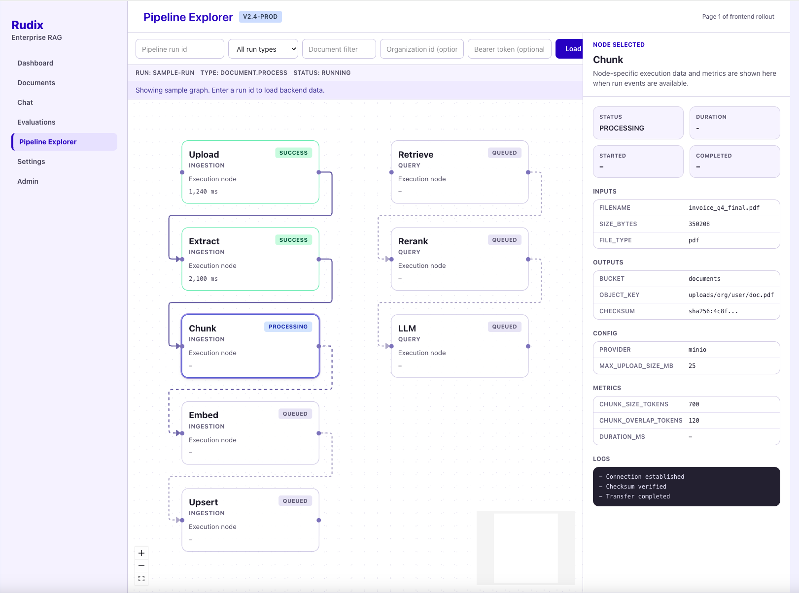

# Rudix

Rudix is a full-stack **AI Document Q&A Assistant** built with Retrieval-Augmented Generation, also known as RAG. It allows users to upload documents, process them into searchable knowledge, and ask natural-language questions against those documents.

The goal of Rudix is to provide reliable, source-grounded answers from uploaded files. Instead of generating responses from general model knowledge alone, Rudix retrieves relevant document chunks, sends them to an LLM, and returns answers with supporting context, citations, confidence signals, and usage metrics.

This repository contains the backend API, frontend application, background workers, infrastructure setup, and documentation needed to understand, run, and extend the system.

---

## What Rudix Does

Rudix is designed for document-based AI workflows.

A typical flow looks like this:

```mermaid
flowchart LR
  subgraph Ingestion Pipeline (Async)
    direction TB
    A[Next.js Upload UI]
    B[FastAPI /documents/upload]
    C[MinIO object storage]
    D[Celery worker via RabbitMQ]
    E[Extract, clean, and chunk text]
    F[OpenAI embeddings]
    G[Qdrant vector upsert]
    H[PostgreSQL metadata and status]
    A --> B --> C --> D --> E --> F --> G
    B --> H
    E --> H
    G --> H
  end

  subgraph Query Pipeline (Realtime)
    direction TB
    I[Next.js Chat UI]
    J[FastAPI /chat]
    K[OpenAI query embedding]
    L[Qdrant retrieval with org filters]
    M[Optional rerank]
    N[OpenAI answer generation]
    O[Return answer, citations, confidence, metadata]
    P[Persist chat messages, citations, usage events in PostgreSQL]
    I --> J --> K --> L --> M --> N --> O
    N --> P
    O --> P
  end

  H --> J
  G --> L
```

Supported document types include:

- PDF
- TXT
- DOCX

---

## Main Features

- Document upload and storage
- Text extraction and cleaning
- Chunking and embedding generation
- Vector search with Qdrant
- Question answering with OpenAI models
- Source-grounded responses
- Citations and confidence scoring
- Audit logs for upload/delete/query/evaluation/admin actions (with sensitive metadata redaction)
- Background processing with Celery
- PostgreSQL metadata storage
- MinIO object storage
- Redis caching and rate-limit support
- RabbitMQ task queue
- Docker-based local development
- Production-focused architecture documentation

---

## Business Use Cases

- 🏢 **Internal knowledge assistant**: Answer employee questions from SOPs, policies, handbooks, and team playbooks.
- 🎧 **Support agent copilot**: Help support teams resolve tickets faster using product docs, runbooks, and release notes.
- 🛡️ **Compliance and audit evidence lookup**: Retrieve cited answers from controlled documents with audit-ready traces.
- ⚖️ **Legal and contract Q&A**: Search contracts and legal guidance to find clauses, obligations, and deadlines quickly.
- 👥 **HR policy assistant**: Provide grounded responses for onboarding, leave, benefits, and internal process questions.
- 🔧 **Operations and incident runbooks**: Assist DevOps/SRE with fast retrieval of troubleshooting and incident procedures.
- 📈 **Sales enablement search**: Query battle cards, case studies, pricing collateral, and proposal templates.
- 📑 **Procurement and vendor review**: Compare RFPs, vendor responses, and security/compliance questionnaires.
- 🔬 **Research and analyst workspace**: Explore reports and technical docs with citations and confidence indicators.
- 🧩 **Multi-tenant knowledge portals**: Offer organization-isolated document Q&A with role-based access control.
- 📊 **AI operations visibility**: Monitor ingestion, indexing, failures, latency, confidence, and usage/cost trends.

---

## Frontend Example Page

### Pipeline Explorer (`/rag-pipeline`)



The Pipeline Explorer page gives users a live view of the RAG execution flow and node-level diagnostics:

- Visual graph of ingestion and query stages (`Upload`, `Extract`, `Chunk`, `Embed`, `Upsert`, `Retrieve`, `Rerank`, `LLM`)
- Distinct node statuses (`queued`, `processing`, `success`, `failed`) for fast operational triage
- Run controls for loading a specific pipeline run with optional run/document/organization context
- Right-side details panel for the selected node: inputs, outputs, config, metrics, and logs
- Permission-aware and error-safe behavior for protected run data

This page is designed for debugging pipeline behavior, validating processing progress, and inspecting failures without querying raw backend logs directly.

---

## Tech Stack

### Frontend

- Next.js
- React
- TypeScript
- Tailwind CSS
- React Flow
- TanStack Query
- Zustand
- React Hook Form
- Zod
- Vitest
- Playwright

### Backend

- FastAPI
- Python 3.12+
- Pydantic
- SQLAlchemy Async
- Alembic
- Celery
- OpenAI API
- PyMuPDF
- python-docx
- RAGAS
- Ruff
- mypy
- pytest

### Infrastructure

- PostgreSQL
- Qdrant
- MinIO
- RabbitMQ
- Redis
- Docker Compose
- Sentry
- Structured logging

---

## Repository Structure

```text
.
├── backend/              # FastAPI API, services, models, workers, migrations, tests
├── frontend/             # Next.js frontend application
├── docs/                 # Architecture, API, deployment, security, and workflow docs
├── docker-compose.yml    # Local infrastructure and backend runtime
├── .env.example          # Example environment configuration
├── Makefile              # Common development commands
└── README.md             # Project overview
```

---

## Getting Started

### 1. Clone the Repository

```bash
git clone https://gitlab.com/benza-group/rudix.git
cd rudix
```

### 2. Create Environment File

```bash
cp .env.example .env
```

Update the required values in `.env`, especially:

```env
OPENAI_API_KEY=
APP_AUTH_SECRET=
```

### 3. Start Backend and Infrastructure

```bash
docker compose up --build
```

Or:

```bash
make up
```

This starts the API, worker, PostgreSQL, Qdrant, MinIO, RabbitMQ, and Redis.

### 4. Run Database Migrations

```bash
make migrate
```

### 5. Start the Frontend

```bash
cd frontend
npm install
npm run dev
```

Frontend:

```text
http://localhost:3000
```

Backend API:

```text
http://localhost:8000
```

---

## Useful Commands

### Root Commands

```bash
make up          # Start services
make up-d        # Start services in detached mode
make down        # Stop services
make logs        # View logs
make migrate     # Run database migrations
make test        # Run backend tests
make lint        # Run backend lint checks
make check-backend   # Run backend lint + tests
make check-frontend  # Run frontend lint + typecheck + tests
make check-all       # Run backend checks, then frontend checks
make frontend-dev    # Start frontend dev server from repo root
make frontend-build  # Build frontend from repo root
make frontend-lint   # Run frontend ESLint from repo root
make frontend-typecheck # Run frontend TypeScript checks from repo root
make frontend-test   # Run frontend unit tests from repo root
make frontend-e2e    # Run frontend Playwright tests from repo root
make frontend-format # Run frontend Prettier check from repo root
```

### Frontend Commands

```bash
cd frontend
npm run dev          # Start frontend dev server
npm run build        # Build frontend
npm run lint         # Run ESLint
npm run typecheck    # Run TypeScript checks
npm run test         # Run frontend tests
npm run test:e2e     # Run Playwright tests
```

### Backend Commands

```bash
cd backend
make install      # Install backend dependencies
make run-api      # Run FastAPI locally
make run-worker   # Run Celery worker locally
make migrate      # Apply migrations
make test         # Run tests
make lint         # Run lint and type checks
```

---

## Local Service URLs

| Service | URL |
|---|---|
| Frontend | `http://localhost:3000` |
| Backend API | `http://localhost:8000` |
| API Health | `http://localhost:8000/api/v1/health` |
| MinIO Console | `http://localhost:9001` |
| RabbitMQ UI | `http://localhost:15672` |
| Qdrant | `http://localhost:6333` |
| PostgreSQL | `localhost:5432` |
| Redis | `localhost:6379` |

---

## Documentation

Detailed documentation is available in the `docs/` directory.

Start here:

- [`docs/README.md`](docs/README.md) — Documentation index
- [`docs/INSTALL.md`](docs/INSTALL.md) — Installation and configuration
- [`docs/01_ARCHITECTURE_OVERVIEW.md`](docs/01_ARCHITECTURE_OVERVIEW.md) — System architecture
- [`docs/02_PRODUCTION_STACK.md`](docs/02_PRODUCTION_STACK.md) — Stack details
- [`docs/03_RAG_WORKFLOW.md`](docs/03_RAG_WORKFLOW.md) — RAG workflow
- [`docs/07_API_DESIGN.md`](docs/07_API_DESIGN.md) — API design
- [`docs/10_DEPLOYMENT_DOCKER.md`](docs/10_DEPLOYMENT_DOCKER.md) — Docker and deployment
- [`docs/11_SECURITY_AND_PRODUCTION_CHECKLIST.md`](docs/11_SECURITY_AND_PRODUCTION_CHECKLIST.md) — Security checklist
- [`docs/12_EVALUATION_AND_MONITORING.md`](docs/12_EVALUATION_AND_MONITORING.md) — Evaluation and monitoring

Frontend-specific details are available in:

- [`frontend/README.md`](frontend/README.md)

---

## Security Notes

Rudix is built with organization-scoped document access in mind. Protected API routes should verify authentication, organization membership, and document ownership before returning data.

Uploaded document content should be treated as untrusted input. Generated answers should be grounded only in retrieved document context, and production deployments should use strong secrets, secure environment variables, rate limits, structured logs, and monitoring.

See [`docs/SECURITY.md`](docs/SECURITY.md) and [`docs/11_SECURITY_AND_PRODUCTION_CHECKLIST.md`](docs/11_SECURITY_AND_PRODUCTION_CHECKLIST.md) for more details.

---

## Project Status

Rudix currently includes a production-oriented architecture, backend scaffold, frontend application setup, Docker Compose infrastructure, worker setup, and detailed implementation documentation.

Some features may still be under active development. Check the docs, issues, and changelog for the latest project status.

---

## Contributing

Contributions are welcome.

Before opening a merge request, run the relevant checks:

```bash
cd backend
make lint
make test
```

```bash
cd frontend
npm run typecheck
npm run lint
npm run test
```

For contribution guidelines, see:

- [`docs/CONTRIBUTING.md`](docs/CONTRIBUTING.md)
- [`docs/CODE_OF_CONDUCT.md`](docs/CODE_OF_CONDUCT.md)

---

## License

License information should be added here.

---

## Maintainers

Maintained by **Benza Group**.
