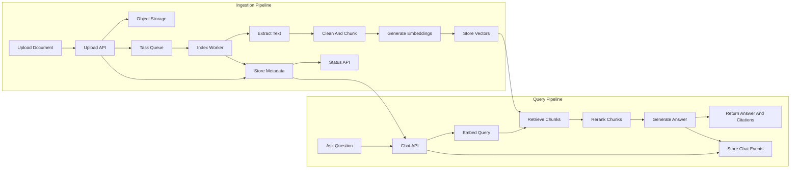
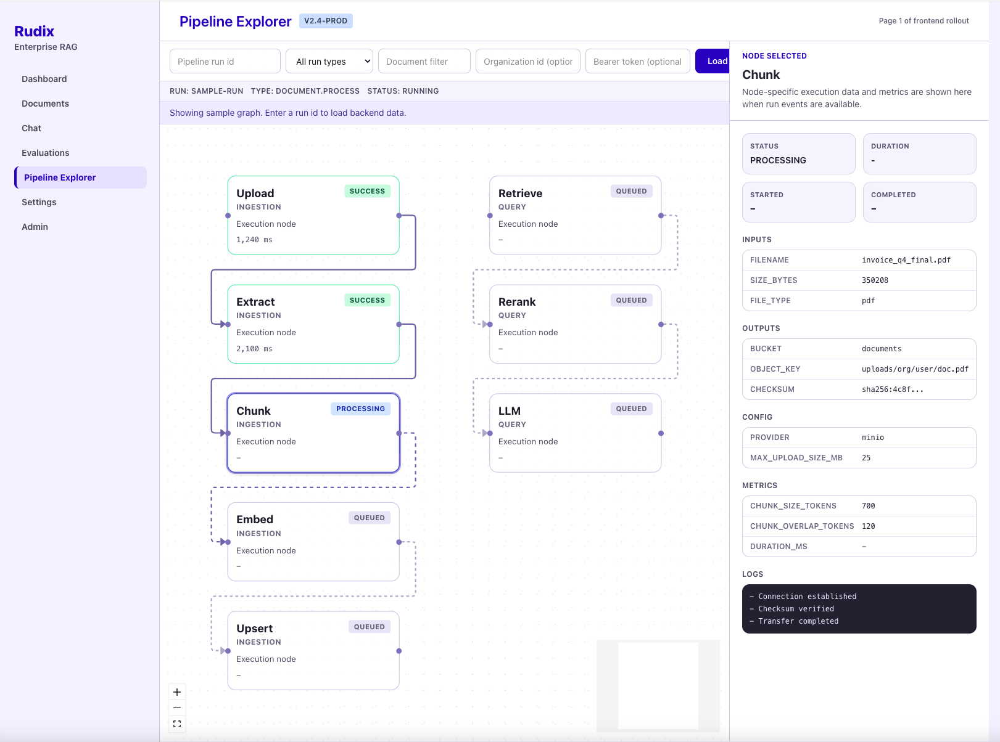

# Rudix

**Self-hostable Retrieval-Augmented Generation (RAG) platform for AI document Q&A, enterprise knowledge search, and internal AI assistants.**

Upload PDFs, Word documents, and text files, index them into searchable knowledge, and ask natural-language questions — Rudix answers with source-grounded citations, confidence scores, and full audit trails instead of guessing from general model knowledge. Built with **FastAPI** and **Next.js**, backed by **Qdrant** vector search, and works with **OpenAI** or fully local/offline LLMs (**Ollama**, **vLLM**, **LiteLLM**).

[](https://github.com/meghrazchi/rudix/actions/workflows/ci.yml)
[](LICENSE.md)
[](backend)
[](frontend)
[](docker-compose.yml)
[](https://getrudix.com)

If you're evaluating a **RAG framework**, an **open-source ChatGPT-for-your-documents** tool, or a **self-hosted enterprise search / knowledge assistant**, this repository contains everything needed to run, understand, and extend Rudix: the backend API, frontend application, background workers, infrastructure setup, and documentation.

---

## Table of Contents

- [Why Rudix](#why-rudix)
- [Business Use Cases](#business-use-cases)
- [What Rudix Does](#what-rudix-does)
- [Main Features](#main-features)
- [RAG Pipeline Explorer UI](#rag-pipeline-explorer-ui-rag-pipeline)
- [Tech Stack](#tech-stack)
- [Repository Structure](#repository-structure)
- [Getting Started](#getting-started)
- [Useful Commands](#useful-commands)
- [Local Service URLs](#local-service-urls)
- [Deployment and CI/CD](#deployment-and-cicd)
- [Local Model Support](#local-model-support)
- [Agentic Mode Notes](#agentic-mode-notes)
- [Documentation](#documentation)
- [Security Notes](#security-notes)
- [FAQ](#faq)
- [Project Status](#project-status)
- [Contributing](#contributing)
- [License](#license)
- [Maintainers](#maintainers)

---

## Why Rudix

- ✅ **Grounded, cited answers** — every response traces back to the exact document and passage it came from, with confidence scoring to cut down on hallucinations.
- 🔐 **Self-hostable and organization-scoped** — run it on your own infrastructure with per-organization data isolation, roles, and permission-aware access control.
- 🧠 **Bring your own model** — OpenAI-compatible out of the box, with first-class support for fully local/offline inference via Ollama, vLLM, or LiteLLM (no cloud dependency required).
- 📊 **Built-in trust and observability** — confidence calibration, source-conflict detection, audit logs, and usage/cost analytics, not bolted on after the fact.
- 💬 **Meets people where they work** — native Slack and Microsoft Teams bot interfaces alongside the web app.

---

## Business Use Cases

- 🏢 **Internal knowledge assistant**: Answer employee questions from SOPs, policies, handbooks, and team playbooks.
- 🎧 **Support agent copilot**: Help support teams resolve tickets faster using product docs, runbooks, and release notes.
- 🛡️ **Compliance and audit evidence lookup**: Retrieve cited answers from controlled documents with audit-ready traces.
- ⚖️ **Legal and contract Q&A**: Search contracts and legal guidance to find clauses, obligations, and deadlines quickly.
- 👥 **HR policy assistant**: Provide grounded responses for onboarding, leave, benefits, and internal process questions.
- 🔧 **Operations and incident runbooks**: Assist DevOps/SRE with fast retrieval of troubleshooting and incident procedures.
- 📈 **Sales enablement search**: Query battle cards, case studies, pricing collateral, and proposal templates.
- 📑 **Procurement and vendor review**: Compare RFPs, vendor responses, and security/compliance questionnaires.
- 🔬 **Research and analyst workspace**: Explore reports and technical docs with citations and confidence indicators.
- 🧩 **Multi-tenant knowledge portals**: Offer organization-isolated document Q&A with role-based access control.
- 📊 **AI operations visibility**: Monitor ingestion, indexing, failures, latency, confidence, and usage/cost trends.
- 📈 **Privacy-aware product analytics**: Optional Matomo tracking plus admin-safe activation and feature-usage summaries.

---

## What Rudix Does

Rudix is designed for document-based AI workflows.

A typical flow looks like this:


```mermaid
flowchart LR
  subgraph ING[Ingestion Pipeline]
    U[Upload Document]
    APIU[Upload API]
    OBJ[Object Storage]
    QUEUE[Task Queue]
    WORKER[Index Worker]
    EXTRACT[Extract Text]
    CHUNK[Clean And Chunk]
    EMBED[Generate Embeddings]
    VECTOR[Store Vectors]
    META[Store Metadata]
    STATUS[Status API]

    U --> APIU --> OBJ
    APIU --> META
    APIU --> QUEUE --> WORKER --> EXTRACT --> CHUNK --> EMBED --> VECTOR
    WORKER --> META
    META --> STATUS
  end

  subgraph QRY[Query Pipeline]
    ASK[Ask Question]
    APIC[Chat API]
    QEMB[Embed Query]
    RETRIEVE[Retrieve Chunks]
    RERANK[Rerank Chunks]
    ANSWER[Generate Answer]
    RETURN[Return Answer And Citations]
    EVENTS[Store Chat Events]

    ASK --> APIC --> QEMB --> RETRIEVE --> RERANK --> ANSWER --> RETURN
    APIC --> EVENTS
    ANSWER --> EVENTS
  end

  VECTOR --> RETRIEVE
  META --> APIC
```

Supported document types include:

- PDF
- TXT
- DOCX

---

## Main Features

- Document upload and storage
- Text extraction and cleaning
- Chunking and embedding generation
- Vector search with Qdrant
- Question answering with OpenAI models
- Source-grounded responses
- Safe product guidance for onboarding, UI, and source-scope help when no document evidence is needed
- Citations and confidence scoring
- Multilingual UI locales plus language-aware chat, OCR, and document controls
- Slack and Microsoft Teams bot ask interface with mapped-user permissions
- Audit logs for upload/delete/query/evaluation/admin actions (with sensitive metadata redaction)
- Admin-controlled workspace data import/export for metadata, collections, chats, evaluations, audit records, and safe configuration portability
- Standalone MCP server mode for read-only context tools (disabled by default)
- Background processing with Celery
- PostgreSQL metadata storage
- MinIO object storage
- Redis caching and rate-limit support
- RabbitMQ task queue
- Docker-based local development
- Production-focused architecture documentation

---

## RAG Pipeline Explorer UI (`/rag-pipeline`)



The Pipeline Explorer page gives users a live view of the RAG execution flow and node-level diagnostics:

- Visual graph of ingestion and query stages (`Upload`, `Extract`, `Chunk`, `Embed`, `Upsert`, `Retrieve`, `Rerank`, `LLM`)
- Distinct node statuses (`queued`, `processing`, `success`, `failed`) for fast operational triage
- Run controls for loading a specific pipeline run with optional run/document/organization context
- Right-side details panel for the selected node: inputs, outputs, config, metrics, and logs
- Permission-aware and error-safe behavior for protected run data

This page is designed for debugging pipeline behavior, validating processing progress, and inspecting failures without querying raw backend logs directly.

---

## Tech Stack

### Frontend

- Next.js
- React
- TypeScript
- Tailwind CSS
- React Flow
- TanStack Query
- Zustand
- React Hook Form
- Zod
- Vitest
- Playwright

### Backend

- FastAPI
- Python 3.12+
- Pydantic
- SQLAlchemy Async
- Alembic
- Celery
- OpenAI API
- PyMuPDF
- python-docx
- RAGAS
- Ruff
- mypy
- pytest

### Infrastructure

- PostgreSQL
- Qdrant
- MinIO
- RabbitMQ
- Redis
- Docker Compose
- Sentry
- Structured logging

---

## Repository Structure

```text
.
├── backend/              # FastAPI API, services, models, workers, migrations, tests
├── frontend/             # Next.js frontend application
├── docs/                 # Architecture, API, deployment, security, and workflow docs
├── docker-compose.yml    # Local infrastructure and backend runtime
├── .env.example          # Example environment configuration
├── Makefile              # Common development commands
└── README.md             # Project overview
```

---

## Getting Started

### 1. Clone the Repository

```bash
git clone https://github.com/meghrazchi/rudix.git
cd rudix
```

### 2. Create Environment File

```bash
cp .env.example .env
```

Update the required values in `.env`, especially:

```env
OPENAI_API_KEY=
APP_AUTH_SECRET=
```

### 3. Start Backend and Infrastructure

```bash
docker compose up --build
```

Or:

```bash
make up
```

This starts the API, worker, PostgreSQL, Qdrant, MinIO, RabbitMQ, Redis, and the optional Matomo analytics stack.

### 4. Run Database Migrations

```bash
make migrate
```

### 5. Start the Frontend

```bash
cd frontend
npm install
npm run dev
```

Frontend:

```text
http://localhost:3000
```

Backend API:

```text
http://localhost:8000
```

---

## Useful Commands

### Root Commands

```bash
make up          # Start services
make up-d        # Start services in detached mode
make down        # Stop services
make logs        # View logs
make migrate     # Run database migrations
make test        # Run backend tests
make lint        # Run backend lint checks
make check-backend   # Run backend lint + tests
make check-frontend  # Run frontend lint + typecheck + tests
make check-all       # Run backend checks, frontend checks, and API type staleness check
make api-types       # Regenerate frontend types from committed openapi.json
make api-types-check # Verify generated types are up to date (used in CI)
make api-types-update # Fetch fresh openapi.json from running backend and regenerate types
make up-mcp          # Start standalone MCP server profile
make logs-mcp        # Tail MCP service logs
make frontend-dev    # Start frontend dev server from repo root
make frontend-build  # Build frontend from repo root
make frontend-lint   # Run frontend ESLint from repo root
make frontend-typecheck # Run frontend TypeScript checks from repo root
make frontend-test   # Run frontend unit tests from repo root
make frontend-e2e    # Run frontend Playwright tests from repo root
make frontend-format # Run frontend Prettier check from repo root
```

### Frontend Commands

```bash
cd frontend
npm run dev          # Start frontend dev server
npm run build        # Build frontend
npm run lint         # Run ESLint
npm run typecheck    # Run TypeScript checks
npm run test         # Run frontend tests
npm run test:e2e     # Run Playwright tests
```

### Backend Commands

```bash
cd backend
make install      # Install backend dependencies
make run-api      # Run FastAPI locally
make run-worker   # Run Celery worker locally
make migrate      # Apply migrations
make test         # Run tests
make lint         # Run lint and type checks
```

---

## Local Service URLs

| Service                       | URL                                   |
| ----------------------------- | ------------------------------------- |
| Frontend                      | `http://localhost:3000`               |
| Backend API                   | `http://localhost:8000`               |
| MCP Server (optional profile) | `http://localhost:8010`               |
| API Health                    | `http://localhost:8000/api/v1/health` |
| Swagger UI                    | `http://localhost:8000/docs`          |
| ReDoc                         | `http://localhost:8000/redoc`         |
| OpenAPI Schema                | `http://localhost:8000/openapi.json`  |
| MinIO Console                 | `http://localhost:9001`               |
| RabbitMQ UI                   | `http://localhost:15672`              |
| Qdrant                        | `http://localhost:6333`               |
| PostgreSQL                    | `localhost:5432`                      |
| Redis                         | `localhost:6379`                      |

---

## Deployment and CI/CD

Rudix uses GitHub Actions for repository automation. The workflow files under `.github/workflows/` are the source of truth for maintainer-facing CI, security, release, and evaluation automation:

- `ci.yml` runs configuration validation, backend checks, frontend checks, API type verification, and build validation
- `playwright.yml` runs the standalone Playwright end-to-end suite on demand
- `security.yml` runs dependency and filesystem vulnerability scans and publishes the backend dependency audit report as an artifact
- `codeql.yml` runs Python and TypeScript CodeQL analysis
- `release.yml` builds and publishes images, runs integration smoke tests, deploys staging, deploys production with environment approval, and supports rollback
- `quality-gate.yml` runs the evaluation quality gate on demand
- `accuracy-eval.yml` runs the accuracy evaluation gate on a nightly schedule and on demand

Rudix-hosted deployments use these exact public URLs:

| Environment | Frontend URL                   | API URL                                   |
| ----------- | ------------------------------ | ----------------------------------------- |
| Staging     | `https://staging.getrudix.com` | `https://api-staging.getrudix.com/api/v1` |
| Production  | `https://getrudix.com`         | `https://api.getrudix.com/api/v1`         |

For workflow details, see:

- [`docs/14_GITHUB_ACTIONS_CI_CD_PIPELINE.md`](docs/14_GITHUB_ACTIONS_CI_CD_PIPELINE.md)

---

## Local Model Support

Rudix can route generation and embedding through any OpenAI-compatible local server such as Ollama, vLLM, or LiteLLM — no cloud dependency required.

```bash
# Start Ollama and pull a model
make up-ollama
make pull-local-model

# Set in .env
LLM_DEFAULT_PROVIDER=local
LOCAL_LLM_BASE_URL=http://ollama:11434/v1
LOCAL_LLM_MODEL=llama3.2
LOCAL_LLM_JSON_MODE_ENABLED=false
FEATURE_ENABLE_LOCAL_LLM_PROFILES=true
```

See [`.env.local-llm.example`](.env.local-llm.example) for a ready-to-copy environment file and [`docs/19_LOCAL_LLM_PROVIDER_INTEGRATION.md`](docs/19_LOCAL_LLM_PROVIDER_INTEGRATION.md) for full setup instructions, security requirements, evaluation gates, and operational runbooks.

---

## Agentic Mode Notes

Chat agentic mode uses backend agent run APIs and is controlled by feature flags.

- Frontend toggle visibility: `NEXT_PUBLIC_CHAT_AGENTIC_ENABLED`
- Backend runtime gate: `FEATURE_ENABLE_AGENTS`
- Agent run endpoints:
  - `POST /api/v1/agent/runs`
  - `GET /api/v1/agent/runs/{run_id}`

If agentic mode is enabled in frontend but disabled in backend, requests can return `404` with a feature-not-available response.

---

## Documentation

Detailed documentation is available in the `docs/` directory.

Start here:

- [`docs/README.md`](docs/README.md) — Documentation index
- [`docs/INSTALL.md`](docs/INSTALL.md) — Installation and configuration
- [`docs/01_ARCHITECTURE_OVERVIEW.md`](docs/01_ARCHITECTURE_OVERVIEW.md) — System architecture
- [`docs/02_PRODUCTION_STACK.md`](docs/02_PRODUCTION_STACK.md) — Stack details
- [`docs/03_RAG_WORKFLOW.md`](docs/03_RAG_WORKFLOW.md) — RAG workflow
- [`docs/07_API_DESIGN.md`](docs/07_API_DESIGN.md) — API design
- [`docs/10_DEPLOYMENT_DOCKER.md`](docs/10_DEPLOYMENT_DOCKER.md) — Docker and deployment
- [`docs/11_SECURITY_AND_PRODUCTION_CHECKLIST.md`](docs/11_SECURITY_AND_PRODUCTION_CHECKLIST.md) — Security checklist
- [`docs/12_EVALUATION_AND_MONITORING.md`](docs/12_EVALUATION_AND_MONITORING.md) — Evaluation and monitoring
- [`docs/13_AGENTIC_ARCHITECTURE_AND_CAPABILITY_MODEL.md`](docs/13_AGENTIC_ARCHITECTURE_AND_CAPABILITY_MODEL.md) — Agentic architecture and capability model
- [`docs/14_GITHUB_ACTIONS_CI_CD_PIPELINE.md`](docs/14_GITHUB_ACTIONS_CI_CD_PIPELINE.md) — GitHub Actions CI and security flow
- [`docs/15_MCP_SERVER_DEPLOYMENT_MODE.md`](docs/15_MCP_SERVER_DEPLOYMENT_MODE.md) — MCP architecture (Mermaid), tools/resources/prompts, deployment
- [`docs/18_LANGFUSE_OBSERVABILITY.md`](docs/18_LANGFUSE_OBSERVABILITY.md) — Langfuse LLM observability: traces, redaction, sampling, production setup
- [`docs/19_LOCAL_LLM_PROVIDER_INTEGRATION.md`](docs/19_LOCAL_LLM_PROVIDER_INTEGRATION.md) — Local LLM providers: Ollama/vLLM/LiteLLM setup, security, evaluation, runbooks
- `ci/security/security_gate_allowlist.json` — tracked temporary allowlist for CI severity gate exceptions

Frontend-specific details are available in:

- [`frontend/README.md`](frontend/README.md)

---

## Security Notes

Rudix is built with organization-scoped document access in mind. Protected API routes should verify authentication, organization membership, and document ownership before returning data.

Uploaded document content should be treated as untrusted input. Generated answers should be grounded only in retrieved document context, and production deployments should use strong secrets, secure environment variables, rate limits, structured logs, and monitoring.

See [`docs/SECURITY.md`](docs/SECURITY.md) and [`docs/11_SECURITY_AND_PRODUCTION_CHECKLIST.md`](docs/11_SECURITY_AND_PRODUCTION_CHECKLIST.md) for more details.

---

## FAQ

**What is Rudix?**
Rudix is a self-hostable Retrieval-Augmented Generation (RAG) platform for document Q&A. You upload PDFs, Word documents, and text files, and Rudix answers natural-language questions about them with source citations and confidence scores.

**Is Rudix open source?**
Yes. The source code is public under the [PolyForm Noncommercial License 1.0.0](#license) — free to use, modify, and self-host for noncommercial purposes. Commercial use requires a separate license.

**Can Rudix run fully offline / without OpenAI?**
Yes. Rudix supports fully local, offline inference through any OpenAI-compatible server — Ollama, vLLM, or LiteLLM — for both generation and embeddings, with no cloud dependency required. See [Local Model Support](#local-model-support).

**How is Rudix different from LangChain or LlamaIndex?**
LangChain and LlamaIndex are libraries/frameworks you build an application on top of. Rudix is a complete, deployable application — backend API, frontend UI, background workers, auth, and infrastructure included — ready to run with `docker compose up`.

**Does Rudix support multi-tenant / multi-organization deployments?**
Yes. Rudix is organization-scoped by design, with per-organization data isolation, role-based access control, and permission-aware document retrieval.

**What document types does Rudix support?**
PDF, DOCX, and TXT out of the box, with OCR and multilingual document handling. See [What Rudix Does](#what-rudix-does).

**Can I use Rudix from Slack or Microsoft Teams?**
Yes. Rudix includes native Slack and Microsoft Teams bot interfaces with mapped-user permissions, in addition to the web app.

---

## Project Status

Rudix currently includes a production-oriented architecture, backend scaffold, frontend application setup, Docker Compose infrastructure, worker setup, and detailed implementation documentation.

Some features may still be under active development. Check the docs, issues, and changelog for the latest project status.

---

## Contributing

Contributions are welcome.

Before opening a pull request, run the relevant checks:

```bash
cd backend
make lint
make test
```

```bash
cd frontend
npm run typecheck
npm run lint
npm run test
```

For contribution guidelines, see:

- [`docs/CONTRIBUTING.md`](docs/CONTRIBUTING.md)
- [`docs/CODE_OF_CONDUCT.md`](docs/CODE_OF_CONDUCT.md)

If Rudix is useful to you, consider starring the repository — it helps others discover the project.

---

## License

This project is licensed under the **PolyForm Noncommercial License 1.0.0**.

Copyright 2026 Behzad Meghrazchi

You may use, copy, modify, and distribute this software for **noncommercial purposes only**. Commercial use — including use by companies, in paid products or services, SaaS/hosted deployments, or for consulting — requires a separate commercial license from the copyright holder.

For commercial licensing inquiries, contact the project owner.

See [`LICENSE.md`](LICENSE.md) for the full terms, or visit the [PolyForm Noncommercial License 1.0.0](https://polyformproject.org/licenses/noncommercial/1.0.0).

---

## Maintainers

Maintained by **Behzad Meghrazchi**.
