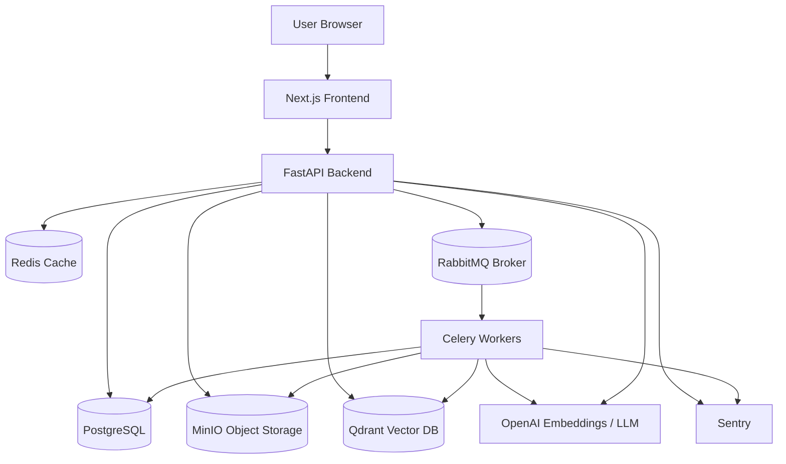
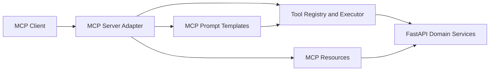
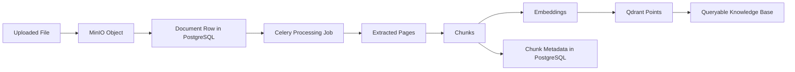

# 01 — Architecture Overview

## Product goal

Build a production-ready AI Document Q&A Assistant where users can upload documents and ask questions. The system answers using only the uploaded documents, returns citations, shows confidence, and tracks evaluation metrics.

## Core capabilities

- Upload PDF, TXT, and DOCX files.
- Store original files in MinIO.
- Extract text page-by-page or section-by-section.
- Clean and normalize extracted text.
- Chunk text using recursive chunking first, semantic chunking later.
- Generate embeddings using OpenAI embeddings.
- Store vectors and payload metadata in Qdrant.
- Store application metadata in PostgreSQL.
- Ask questions through a Next.js chat interface.
- Retrieve top-k relevant chunks.
- Re-rank retrieved chunks.
- Build grounded prompts.
- Generate answers using a configurable OpenAI model.
- Return citations and source snippets.
- Compute confidence scores.
- Evaluate answers using RAGAS and custom metrics.
- Monitor errors, latency, cost, and failed jobs.
- Normalize external connector sources such as Jira, Confluence, and Google
  Drive before they enter the shared ingestion and query lifecycle.

## High-level architecture



## MCP adapter architecture (optional)

Rudix exposes MCP as a separate adapter service when enabled. It reuses the
same domain tool contracts and authorization boundaries as the API runtime.

For full MCP diagrams (standard host/client/server model, Rudix module map,
tool/resource/prompt flows, and deployment topology), see
[15_MCP_SERVER_DEPLOYMENT_MODE.md](./15_MCP_SERVER_DEPLOYMENT_MODE.md) and the
reference discussion in
[MCP Architecture and Components](https://chatgpt.com/share/6a117df8-0808-83eb-9e15-78dff162d648).



Design constraints:

- MCP is disabled by default and enabled explicitly per environment.
- MCP tools are read-only by default; side-effect actions remain API-only unless approved.
- MCP prompt templates are provider-neutral workflows that guide tool usage; they do not bypass authorization.

## Service responsibilities

| Service | Responsibility |
|---|---|
| Next.js frontend | User interface, document upload, chat, citations, pipeline explorer |
| FastAPI backend | REST API, auth verification, orchestration, query pipeline |
| PostgreSQL | Source of truth for users, documents, chunks, messages, citations, evaluations |
| MinIO | Stores uploaded files and extracted text artifacts |
| Qdrant | Stores vector embeddings and chunk payloads |
| RabbitMQ | Reliable task queue broker |
| Celery workers | Long-running background jobs: extraction, chunking, embeddings, indexing |
| Redis | Cache, rate limit helper, optional Celery result backend |
| OpenAI | Embeddings and LLM answer generation |
| Sentry | Error monitoring and production debugging |

## Connector platform boundary

External providers use the connector platform documented in
[16_CONNECTOR_PLATFORM.md](./16_CONNECTOR_PLATFORM.md). Provider adapters write
organization-scoped connections, sources, normalized external items, sync runs,
tombstones, and source-document references. RAG, document lifecycle, chat, and
citation services consume existing `documents`, chunks, and provider-neutral
source references; they must not branch on provider-specific Jira, Confluence,
or Google Drive behavior.

## Why split ingestion and query pipelines?

The ingestion pipeline is slow and should run asynchronously.

The query pipeline must be fast and run in real time.

```text
Ingestion = upload → extract → chunk → embed → index
Query     = question → retrieve → rerank → generate → cite
```

## Production design principles

1. **Do not process large documents inside request-response calls.** Use Celery workers.
2. **PostgreSQL is the source of truth.** Qdrant and MinIO are external storage systems referenced by database records.
3. **Every vector must include metadata filters.** At minimum: `organization_id`, `user_id`, `document_id`, `chunk_id`, `page_number`.
4. **Every answer must be source-grounded.** If no strong context exists, the system should refuse or say the answer was not found.
5. **Every job must be idempotent.** Background jobs may retry. They must not duplicate chunks or vectors.
6. **Every user query must be permission-filtered.** Qdrant search should never retrieve chunks from documents the user cannot access.
7. **Model names must be configurable.** Use environment variables for LLM and embedding model names.
8. **Evaluation is part of the product.** Track retrieval quality, citation correctness, faithfulness, latency, and cost.

## Core data lifecycle



## Runtime query lifecycle


