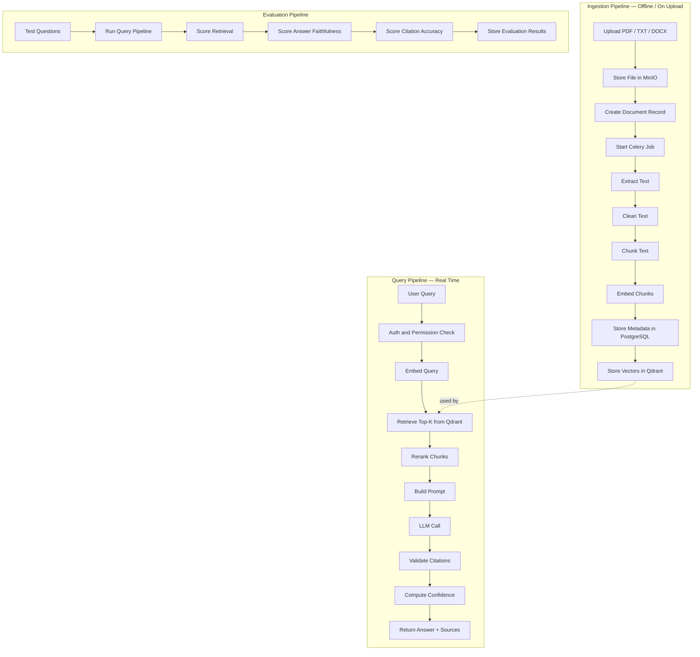
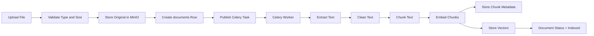
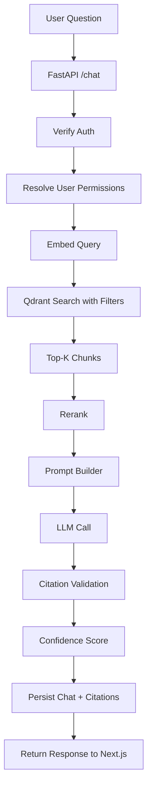
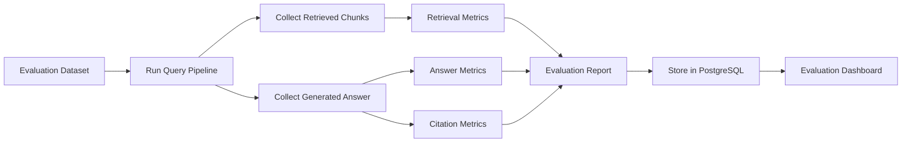

# 03 — RAG Workflow

This file describes the full Retrieval-Augmented Generation workflow.

## Workflow overview



## Ingestion pipeline

The ingestion pipeline runs when a user uploads a document.

### Steps

1. User uploads a file from the Next.js frontend.
2. FastAPI validates file type and size.
3. Backend uploads the file to MinIO.
4. Backend creates a `documents` row with status `uploaded`.
5. Backend enqueues a Celery task.
6. Worker extracts text.
7. Worker cleans and normalizes text.
8. Worker chunks text.
9. Worker stores chunk metadata in PostgreSQL.
10. Worker calls embedding model for each chunk.
11. Worker stores vectors and payload metadata in Qdrant.
12. Worker updates document status to `indexed`.

### Ingestion Mermaid diagram



## Supported files

| File type | Extractor |
|---|---|
| PDF | PyMuPDF |
| TXT | Native text reader |
| DOCX | python-docx |

## Text extraction strategy

### PDF

- Extract page by page.
- Store page number.
- Preserve text mapping for citations.

### TXT

- Treat as one document.
- Use synthetic page number `1`.

### DOCX

- Extract paragraphs and tables.
- Store section or paragraph index.
- If page numbers are unavailable, cite section or paragraph.

## Chunking strategy

Start with recursive chunking.

Recommended default:

```text
chunk_size_tokens = 700
chunk_overlap_tokens = 120
min_chunk_tokens = 80
```

Chunk metadata:

```json
{
  "chunk_id": "uuid",
  "document_id": "uuid",
  "page_number": 4,
  "chunk_index": 12,
  "token_count": 690,
  "text": "..."
}
```

## Semantic chunking

Add semantic chunking later.

Use semantic chunking when documents have clear topic shifts, such as:

- Legal documents.
- Research papers.
- Policy manuals.
- Technical documentation.

## Embedding strategy

Rules:

- Embed every chunk once after ingestion.
- Store embedding model name.
- Store index version.
- Use the same embedding model for user queries.
- Re-index when embedding model changes.

## Query pipeline

The query pipeline runs when a user asks a question.

### Steps

1. Frontend sends question to `/chat`.
2. FastAPI verifies auth token.
3. Backend checks document permissions.
4. Backend embeds the question.
5. Backend searches Qdrant with metadata filters.
6. Backend retrieves top-k candidate chunks.
7. Backend re-ranks chunks.
8. Backend builds a context block.
9. Backend calls the LLM.
10. Backend validates citations.
11. Backend computes confidence score.
12. Backend stores the answer and citations.
13. Backend returns the answer to frontend.

### Query Mermaid diagram



## Retrieval configuration

Default:

```text
initial_top_k = 20
final_top_k = 5
similarity_metric = cosine
reranking = MMR first, cross-encoder later
```

## Re-ranking

Use two stages:

### Stage 1: Vector retrieval

Qdrant returns top 20 similar chunks.

### Stage 2: Reranking

Options:

- MMR for diversity.
- Cross-encoder for quality.
- LLM-based reranking for small top-k sets.

Recommended production path:

```text
MVP: Qdrant top-k only
V1: Qdrant top-20 + MMR top-5
V2: Qdrant top-30 + cross-encoder top-5
```

## Prompt builder

Prompt must enforce source grounding.

Template:

```text
You are an AI document assistant.

Use only the provided context to answer the question.

Rules:
1. Do not use outside knowledge.
2. If the answer is not in the context, say:
   "I could not find this information in the uploaded documents."
3. Cite the filename and page number for every factual claim.
4. Be concise.
5. Do not invent citations.

Question:
{question}

Context:
{context_chunks}

Return JSON:
{
  "answer": "...",
  "citations": [
    {
      "document_id": "...",
      "chunk_id": "...",
      "filename": "...",
      "page_number": 1,
      "quote": "short supporting quote"
    }
  ],
  "not_found": false
}
```

## Citation requirements

Each citation should include:

```json
{
  "document_id": "uuid",
  "chunk_id": "uuid",
  "filename": "policy.pdf",
  "page_number": 4,
  "text_snippet": "Employees are entitled to 20 days...",
  "similarity_score": 0.87
}
```

## Confidence score

Confidence combines:

- Top similarity score.
- Average similarity score.
- Reranker score.
- Citation support (coverage + validation).
- Retrieval agreement signal.
- Not-found penalty when the answer is refused or below threshold.

Default weighted formula:

```text
confidence = 
  0.35 * top_similarity +
  0.20 * avg_top_similarity +
  0.20 * rerank_score +
  0.15 * citation_support +
  0.10 * multi_source_agreement
```

Runtime behavior:

- If no context chunks exist, confidence is `0.0` (`low`).
- If `not_found=true`, score is multiplied by `CONFIDENCE_NOT_FOUND_PENALTY_MULTIPLIER`.
- Category thresholds are configurable with:
  - `CONFIDENCE_MEDIUM_THRESHOLD`
  - `CONFIDENCE_HIGH_THRESHOLD`

## Evaluation pipeline



## Evaluation metrics

| Metric | Description |
|---|---|
| Retrieval hit rate | Whether expected source appears in top-k |
| Context precision | Whether retrieved chunks are relevant |
| Context recall | Whether enough relevant context was retrieved |
| Faithfulness | Whether answer is supported by context |
| Answer relevance | Whether answer addresses the question |
| Citation accuracy | Whether citations support claims |
| Refusal accuracy | Whether system refuses when answer is not in docs |
| Latency | Time to answer |
| Cost | Embedding + LLM cost |
