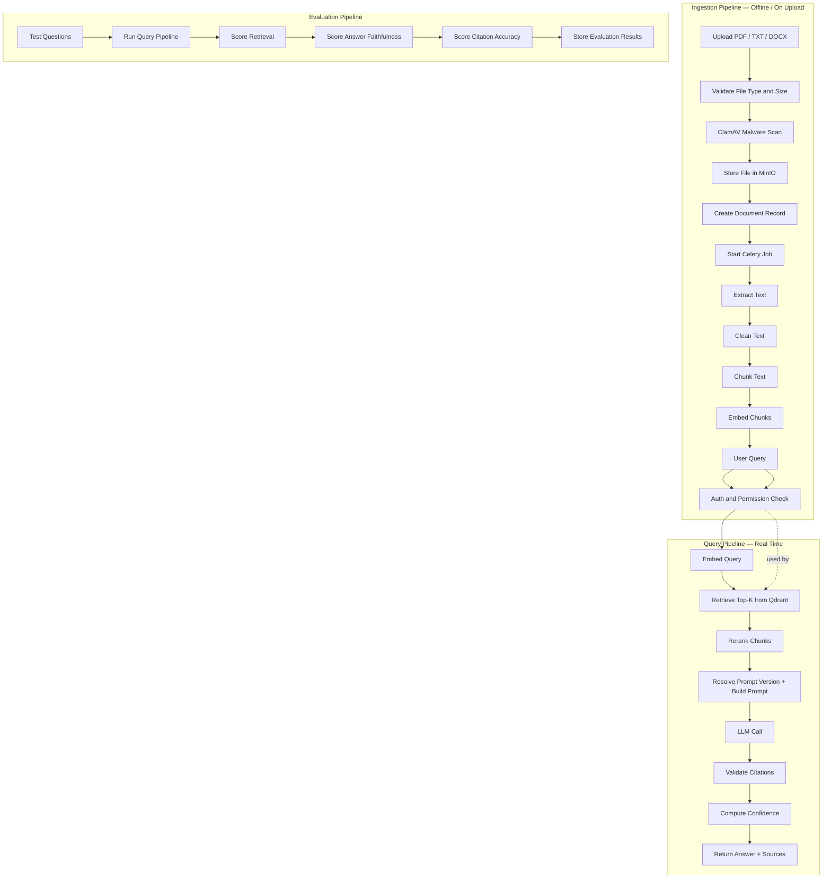
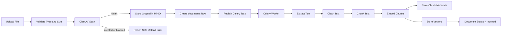
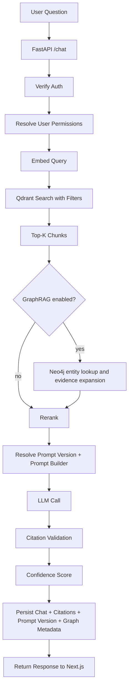
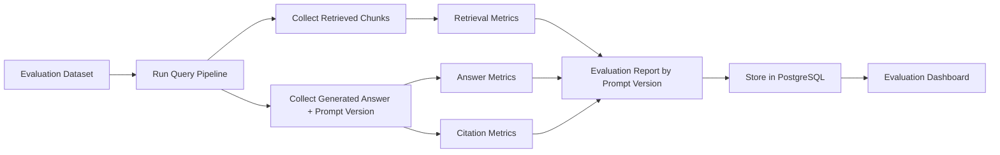

# 03 — RAG Workflow

This file describes the full Retrieval-Augmented Generation workflow.

## Workflow overview



## Ingestion pipeline

The ingestion pipeline runs when a user uploads a document.
Connector providers use the same downstream lifecycle after provider adapters
normalize external items and create or update source-linked document rows. See
[16_CONNECTOR_PLATFORM.md](./16_CONNECTOR_PLATFORM.md) for the connector source
model and extension pattern.

### Steps

1. User uploads a file from the Next.js frontend.
2. FastAPI validates file type and size.
3. FastAPI scans upload bytes with ClamAV before persistence.
4. Backend uploads clean files to MinIO.
5. Backend creates a `documents` row with status `uploaded`.
6. Backend enqueues a Celery task.
7. Worker extracts text.
8. Worker cleans and normalizes text.
9. Worker chunks text.
10. Worker stores chunk metadata in PostgreSQL.
11. Worker calls embedding model for each chunk.
12. Worker stores vectors and payload metadata in Qdrant.
13. Worker updates document status to `indexed`.

Connector ingestion adds a provider-neutral pre-step before item 5:

1. Adapter syncs a provider account, source, or folder.
2. Adapter emits `NormalizedExternalItem` with stable provider IDs, source URL,
   content hash, provider updated timestamp, sync version, organization scope,
   and optional collection scope.
3. Connector service validates organization and collection boundaries.
4. Shared ingestion creates or updates the `documents` row and links provenance
   through `source_documents` and `source_references`. Connector-backed
   documents also carry provider snapshots so citations can deep-link to the
   original connector item even after the source changes.

### Ingestion Mermaid diagram



## Supported files

| File type | Extractor          |
| --------- | ------------------ |
| PDF       | PyMuPDF            |
| TXT       | Native text reader |
| DOCX      | python-docx        |

## Text extraction strategy

### PDF

- Extract page by page.
- Store page number.
- Preserve text mapping for citations.

### TXT

- Treat as one document.
- Use synthetic page number `1`.

### DOCX

- Extract paragraphs and tables.
- Store section or paragraph index.
- If page numbers are unavailable, cite section or paragraph.

## Chunking strategies

The chunking layer uses a registry-based strategy pattern. Each strategy is
chosen based on document type and structure; all share the same token-size and
overlap settings.

| Strategy              | When used                       | Key behaviour                                                                                    |
| --------------------- | ------------------------------- | ------------------------------------------------------------------------------------------------ |
| `token_recursive`     | Default fallback                | Sliding-window token chunking with page-separator tokens                                         |
| `token_fixed`         | Benchmarking                    | Fixed-size windows, no inter-page separators                                                     |
| `paragraph_recursive` | Short articles, FAQs            | Paragraph-aligned boundaries                                                                     |
| `sentence_window`     | Conversational text             | Sentence-level grouping with overlap                                                             |
| `page_aware`          | PDFs, OCR documents             | Never merges across page boundaries; preserves page provenance for citations                     |
| `heading_aware`       | DOCX, Markdown, structured text | Flushes at heading boundaries; treats tables/code/lists as atomic blocks; records `section_path` |
| `adaptive_hybrid`     | Recommended production default  | Selects the best strategy automatically (see below)                                              |

### Adaptive hybrid selection

When `CHUNKING_STRATEGY=adaptive_hybrid`, the pipeline derives heuristic signals
from each document and picks a concrete strategy deterministically:

```text
Priority  Condition                                    Strategy selected
1         force_strategy set in config                 <forced value>
2         PDF + OCR was applied                        page_aware
3         PDF + page_count > 1                         page_aware
4         PDF + heading density ≥ 0.5/page             heading_aware
5         file_type = docx or md                       heading_aware
6         heading density ≥ 0.5/page (any type)        heading_aware
7         total_token_count < 500                      paragraph_recursive
8         (fallback)                                   token_recursive
```

Reason codes (e.g. `pdf_ocr_applied`, `docx_md_structured`, `short_document`,
`fallback_low_confidence`) are stored in `documents.chunking_config_snapshot`
alongside the heuristic signals, so operators can diagnose selection decisions
without accessing raw document text.

Admins can force a specific strategy for individual documents by setting
`force_strategy` in `strategy_options`; this is recorded as reason code
`force_override`.

### Default chunk sizes

```text
CHUNK_SIZE_TOKENS    = 700
CHUNK_OVERLAP_TOKENS = 120
```

### Chunk metadata stored per chunk

```json
{
  "chunk_id": "uuid",
  "document_id": "uuid",
  "page_number": 4,
  "chunk_index": 12,
  "token_count": 690,
  "section_path": "Policy > Leave > Annual Leave",
  "block_type": "paragraph",
  "chunk_hash": "<sha256>"
}
```

## Embedding strategy

Rules:

- Embed every chunk once after ingestion.
- Store embedding model name.
- Store index version.
- Use the same embedding model for user queries.
- Re-index when embedding model changes.

## Multilingual behavior

Rudix currently supports English, German, Spanish, and French across the
language-aware ingestion and query path.

### Document language detection

- Ingestion runs a lightweight detector on extracted text.
- The detected ISO 639-1 code is stored on the document record.
- Low-signal or short documents may remain unlabeled until re-indexed or
  overridden by an admin.

### OCR language selection

- PDF OCR resolves language in this order: document override, detected document
  language, then the workspace default OCR language.
- OCR languages are validated before use and mapped to Tesseract codes.
- Admins can override OCR languages per document when scanned text is noisy or
  the detector chooses the wrong language.

### Query language and answer language

- Chat detects the question language when `FEATURE_ENABLE_LANGUAGE_AWARE_RAG=true`.
- Chat request payloads can force `answer_language` to `en`, `de`, `es`, or
  `fr`.
- `auto` keeps the model free to answer without a hard language instruction.
- `same_as_question` uses the detected question language or falls back to the
  workspace default.
- Citations stay anchored to the original chunk text and page metadata even
  when the answer language changes.

### Retrieval guidance

- Retrieval quality still depends on chunk quality, OCR quality, and source
  coverage.
- Translation does not create evidence where the source text is missing.
- For mixed-language documents, admins should set the document and OCR language
  explicitly before re-indexing.

## Graph lifecycle

When Enterprise Graph is enabled, graph extraction runs after chunking and
before the document is marked fully ready:

1. Document chunks are written to PostgreSQL.
2. When a document enters processing or re-indexing, the backend sets
   `graph_extraction_status=pending` so the UI can show graph work is queued.
3. Graph extraction marks the document `graph_extraction_status=extracting`.
4. Derived entities, aliases, evidence links, and relations are written to Neo4j.
5. Successful completion marks the graph status `completed`; failures mark it
   `failed`; disabled or inapplicable flows use `skipped`.
6. Re-index and graph retry flows clear the prior graph facts for the document
   using the previous extraction run ID when available, so retries do not
   duplicate entities or relations.
7. Connector re-syncs that create or update a document reset graph work to
   `pending`; connector-only documents that are blocked or infected are marked
   `skipped`.
8. Document delete removes graph facts, orphaned evidence, and the graph
   document node so no document-scoped facts remain behind.

Graph-backed chat retrieval is a separate runtime feature. It reuses the same
organization and document scoping as the vector pipeline, but it never replaces
Qdrant. If Neo4j is down or graph expansion returns no evidence-backed chunks,
the backend keeps the normal Qdrant-only answer path.

## Query pipeline

The query pipeline runs when a user asks a question.

### Steps

1. Frontend sends question to `/chat`.
2. FastAPI verifies auth token.
3. Backend checks document permissions.
4. Backend embeds the question.
5. Backend searches Qdrant with metadata filters.
6. Backend retrieves top-k candidate chunks.
7. If `FEATURE_ENABLE_GRAPH_RAG=true` for the organization, the backend looks
   up question entities in Neo4j, expands to related entities and evidence
   within configured hop/entity/chunk limits, and merges graph-backed chunks
   into the candidate set.
8. Backend reranks chunks with the configured provider-backed reranker, capped by the profile/env input limits.
9. Backend resolves the active organization `answer_generation` prompt version and builds a context block.
10. Backend calls the LLM.
11. Backend validates citations.
12. Backend computes confidence score.
13. Backend stores the answer, citations, prompt template version ID, and graph debug metadata.
14. Backend returns the answer to frontend.

### Query Mermaid diagram



## Retrieval configuration

Default:

```text
initial_top_k = 20
final_top_k = 5
similarity_metric = cosine
reranking = provider-backed cross-encoder with safe original-order fallback
```

## Re-ranking

Reranking is a production-only relevance pass that runs after retrieval and before
prompt construction. The selected rerank model can come from the active RAG
profile or the environment defaults.

### Stage 1: Vector retrieval

Qdrant returns top 20 similar chunks.

Parallel retrieval fan-out runs safe branches together when available:

- query embedding for sub-queries
- vector search and keyword search per query
- graph expansion for graph-enabled requests
- shared metadata lookups for freshness and provenance

The parallel executor is bounded by max parallel calls, timeout, retry, token,
and cost budgets. If any branch fails or times out, the remaining branches
continue and merged results are still deduplicated and reranked.

### Stage 2: Reranking

```text
Retrieval -> rerank top-N candidates -> prompt construction
```

Key properties:

- Provider-backed cross-encoder / reranker scoring is applied to the retrieved
  candidates before prompt construction.
- The reranker can be disabled per RAG profile or by request toggle.
- Input size, batch size, timeout, and candidate text truncation are
  configurable through the RAG profile or environment defaults.
- If the reranker fails, times out, or is unavailable, the backend falls back to
  the original retrieval order instead of breaking chat.
- Retrieval diagnostics store original rank, rerank score/rank, final rank, and
  rerank cost/latency metadata for safe admin-visible debugging.
- When multiple retrieved documents disagree, the conflict detector scores
  source agreement before prompt construction, marks preferred/current sources,
  and surfaces conflict context instead of pretending there is a single certain
  answer.
- Conflict detection is gated by `FEATURE_ENABLE_CONFLICT_DETECTION` and can be
  overridden per RAG profile with `conflict_detection_enabled`.

## Prompt builder

Prompt must enforce source grounding.

Template:

```text
You are an AI document assistant.

Use only the provided context to answer the question.

Rules:
1. Do not use outside knowledge.
2. If the answer is not in the context, say:
   "I could not find this information in the uploaded documents."
3. Cite the filename and page number for every factual claim.
4. Be concise.
5. Do not invent citations.

Question:
{question}

Context:
{context_chunks}

Return JSON:
{
  "answer": "...",
  "citations": [
    {
      "document_id": "...",
      "chunk_id": "...",
      "filename": "...",
      "page_number": 1,
      "quote": "short supporting quote"
    }
  ],
  "not_found": false
}
```

## Citation requirements

Each citation should include:

```json
{
  "document_id": "uuid",
  "chunk_id": "uuid",
  "filename": "policy.pdf",
  "page_number": 4,
  "text_snippet": "Employees are entitled to 20 days...",
  "similarity_score": 0.87,
  "source_provider": "confluence",
  "source_title": "PROJ-123",
  "source_section": "Comment 3",
  "source_deep_link": "https://...",
  "source_last_synced_at": "2026-06-05T12:34:56Z",
  "source_trust_status": "trusted"
}
```

## Confidence score

Confidence combines:

- Top similarity score.
- Average similarity score.
- Reranker score.
- Citation support (coverage + validation).
- Retrieval agreement signal.
- Not-found penalty when the answer is refused or below threshold.

Default weighted formula:

```text
confidence =
  0.35 * top_similarity +
  0.20 * avg_top_similarity +
  0.20 * rerank_score +
  0.15 * citation_support +
  0.10 * multi_source_agreement
```

Runtime behavior:

- If no context chunks exist, confidence is `0.0` (`low`).
- If `not_found=true`, score is multiplied by `CONFIDENCE_NOT_FOUND_PENALTY_MULTIPLIER`.
- Category thresholds are configurable with:
  - `CONFIDENCE_MEDIUM_THRESHOLD`
  - `CONFIDENCE_HIGH_THRESHOLD`

## Prompt template versioning

Prompt templates are organization-scoped configuration, not ad-hoc runtime strings.

- Supported template keys are `answer_generation`, `summarization`, `comparison`, `citation_validation`, and `agent_planning`.
- Prompt versions move through `draft`, `review`, and `published` states.
- Published versions are immutable; rollback creates a new published version copied from the selected previous published version.
- Query, evaluation, and agent runs store the prompt template version ID they used.
- The management UI renders previews only with fake context supplied by admins; raw private document text is not required for prompt editing.
- Prompt mutations emit audit events with safe metadata only.

## Evaluation pipeline



## Evaluation metrics

| Metric             | Description                                       |
| ------------------ | ------------------------------------------------- |
| Retrieval hit rate | Whether expected source appears in top-k          |
| Context precision  | Whether retrieved chunks are relevant             |
| Context recall     | Whether enough relevant context was retrieved     |
| Faithfulness       | Whether answer is supported by context            |
| Answer relevance   | Whether answer addresses the question             |
| Citation accuracy  | Whether citations support claims                  |
| Refusal accuracy   | Whether system refuses when answer is not in docs |
| Latency            | Time to answer                                    |
| Cost               | Embedding + LLM cost                              |
