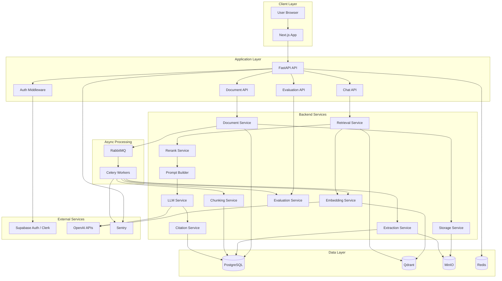
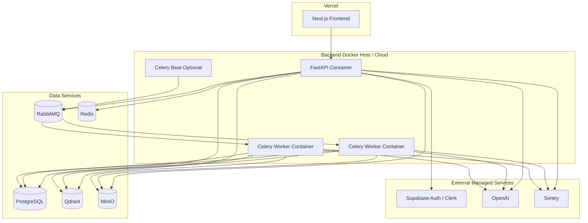
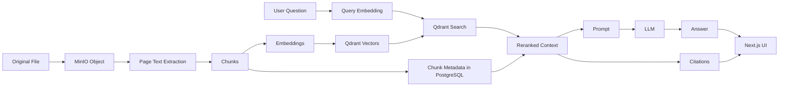
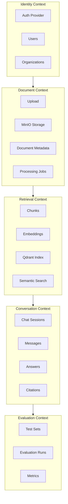
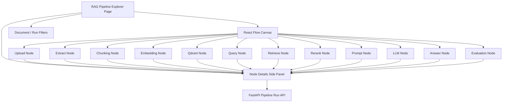
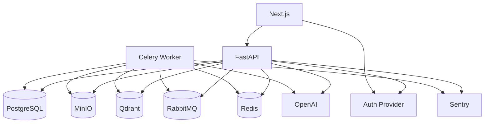

# 04 — Component Diagrams

## System component diagram

## Deployment diagram

## RAG data-flow diagram

## Bounded context diagram

## RAG pipeline explorer UI component diagram

## Infrastructure dependency diagram

