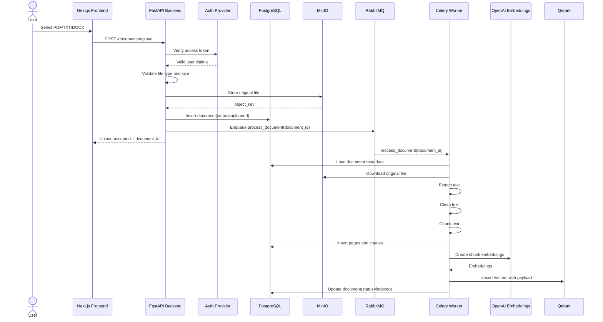
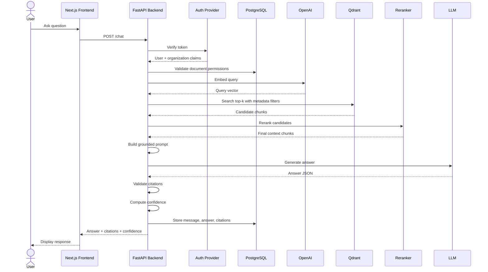
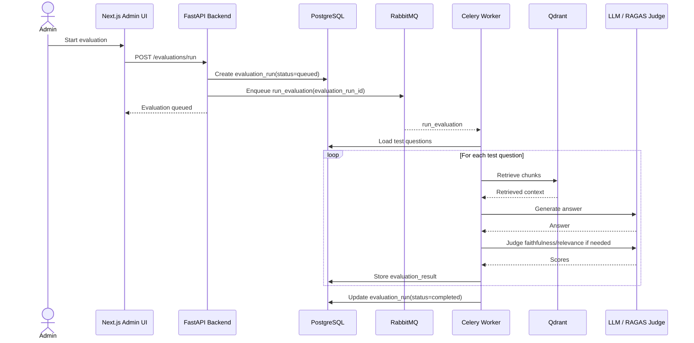
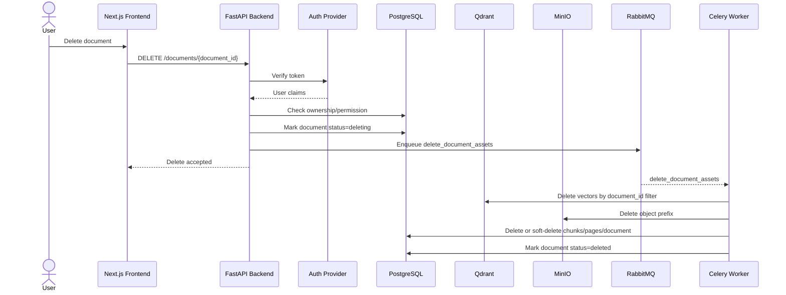
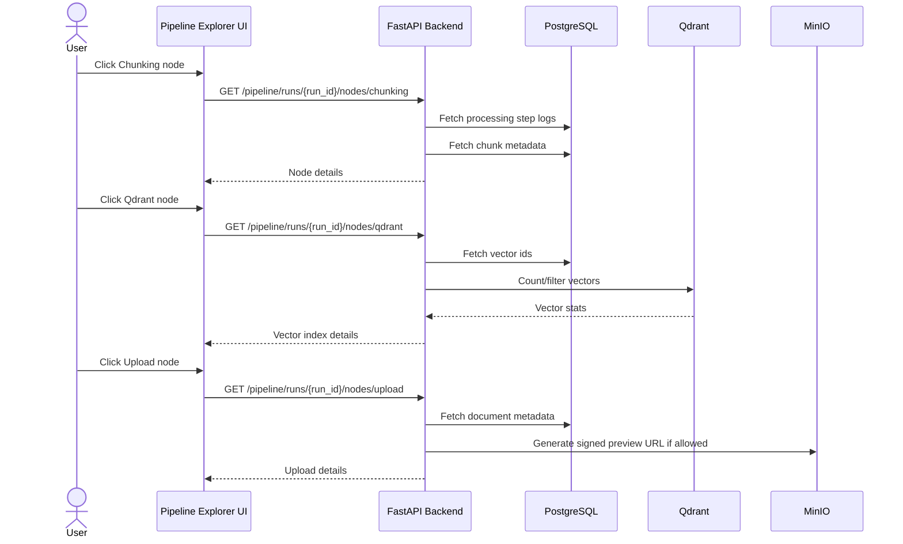
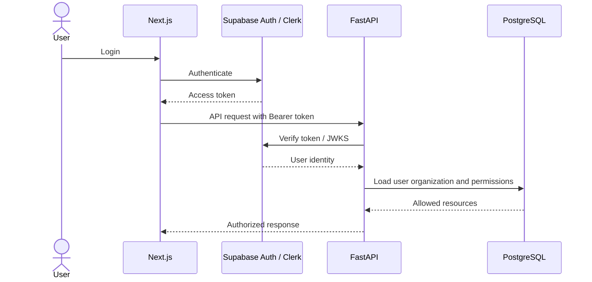

# 05 — Sequence Diagrams

## 1. Upload and indexing sequence

## 2. Real-time question answering sequence

## 3. Evaluation run sequence

## 4. Document deletion sequence

## 5. Pipeline explorer sequence

## 6. Auth and authorization sequence

