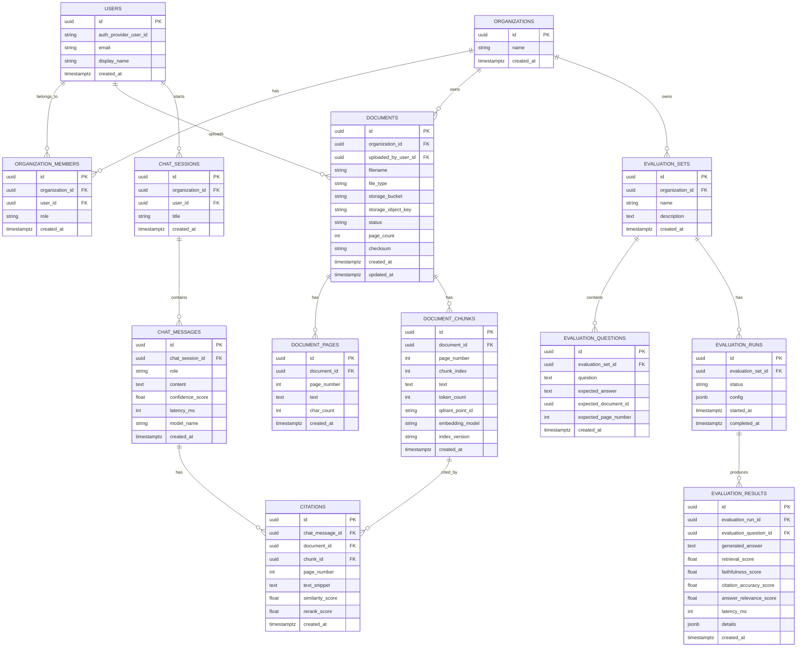

# 06 — Database Schema

PostgreSQL is the source of truth for application state.

Qdrant stores vector embeddings, but PostgreSQL stores document and chunk metadata.

## Entity relationship diagram



## Main tables

### users

Stores internal user mapping.

```sql
CREATE TABLE users (
    id UUID PRIMARY KEY,
    auth_provider_user_id TEXT UNIQUE NOT NULL,
    email TEXT UNIQUE NOT NULL,
    display_name TEXT,
    created_at TIMESTAMPTZ NOT NULL DEFAULT now()
);
```

### organizations

```sql
CREATE TABLE organizations (
    id UUID PRIMARY KEY,
    name TEXT NOT NULL,
    created_at TIMESTAMPTZ NOT NULL DEFAULT now()
);
```

### organization_members

```sql
CREATE TABLE organization_members (
    id UUID PRIMARY KEY,
    organization_id UUID NOT NULL REFERENCES organizations(id),
    user_id UUID NOT NULL REFERENCES users(id),
    role TEXT NOT NULL CHECK (role IN ('owner', 'admin', 'member', 'viewer')),
    created_at TIMESTAMPTZ NOT NULL DEFAULT now(),
    UNIQUE (organization_id, user_id)
);
```

### documents

```sql
CREATE TABLE documents (
    id UUID PRIMARY KEY,
    organization_id UUID NOT NULL REFERENCES organizations(id),
    uploaded_by_user_id UUID NOT NULL REFERENCES users(id),
    filename TEXT NOT NULL,
    file_type TEXT NOT NULL CHECK (file_type IN ('pdf', 'txt', 'docx')),
    storage_bucket TEXT NOT NULL,
    storage_object_key TEXT NOT NULL,
    status TEXT NOT NULL CHECK (
        status IN ('uploaded', 'processing', 'indexed', 'failed', 'deleting', 'deleted')
    ),
    page_count INTEGER,
    checksum TEXT,
    error_message TEXT,
    created_at TIMESTAMPTZ NOT NULL DEFAULT now(),
    updated_at TIMESTAMPTZ NOT NULL DEFAULT now()
);
```

### document_pages

```sql
CREATE TABLE document_pages (
    id UUID PRIMARY KEY,
    document_id UUID NOT NULL REFERENCES documents(id) ON DELETE CASCADE,
    page_number INTEGER NOT NULL,
    text TEXT NOT NULL,
    char_count INTEGER NOT NULL,
    created_at TIMESTAMPTZ NOT NULL DEFAULT now(),
    UNIQUE (document_id, page_number)
);
```

### document_chunks

```sql
CREATE TABLE document_chunks (
    id UUID PRIMARY KEY,
    document_id UUID NOT NULL REFERENCES documents(id) ON DELETE CASCADE,
    page_number INTEGER,
    chunk_index INTEGER NOT NULL,
    text TEXT NOT NULL,
    token_count INTEGER NOT NULL,
    qdrant_point_id TEXT UNIQUE,
    embedding_model TEXT NOT NULL,
    index_version TEXT NOT NULL,
    created_at TIMESTAMPTZ NOT NULL DEFAULT now(),
    UNIQUE (document_id, chunk_index, index_version)
);
```

### chat_sessions

```sql
CREATE TABLE chat_sessions (
    id UUID PRIMARY KEY,
    organization_id UUID NOT NULL REFERENCES organizations(id),
    user_id UUID NOT NULL REFERENCES users(id),
    title TEXT,
    created_at TIMESTAMPTZ NOT NULL DEFAULT now()
);
```

### chat_messages

```sql
CREATE TABLE chat_messages (
    id UUID PRIMARY KEY,
    chat_session_id UUID NOT NULL REFERENCES chat_sessions(id) ON DELETE CASCADE,
    role TEXT NOT NULL CHECK (role IN ('user', 'assistant', 'system')),
    content TEXT NOT NULL,
    confidence_score DOUBLE PRECISION,
    latency_ms INTEGER,
    model_name TEXT,
    token_input_count INTEGER,
    token_output_count INTEGER,
    cost_usd NUMERIC(12, 6),
    created_at TIMESTAMPTZ NOT NULL DEFAULT now()
);
```

### citations

```sql
CREATE TABLE citations (
    id UUID PRIMARY KEY,
    chat_message_id UUID NOT NULL REFERENCES chat_messages(id) ON DELETE CASCADE,
    document_id UUID NOT NULL REFERENCES documents(id),
    chunk_id UUID NOT NULL REFERENCES document_chunks(id),
    page_number INTEGER,
    text_snippet TEXT NOT NULL,
    similarity_score DOUBLE PRECISION,
    rerank_score DOUBLE PRECISION,
    created_at TIMESTAMPTZ NOT NULL DEFAULT now()
);
```

## Evaluation tables

### evaluation_sets

```sql
CREATE TABLE evaluation_sets (
    id UUID PRIMARY KEY,
    organization_id UUID NOT NULL REFERENCES organizations(id),
    name TEXT NOT NULL,
    description TEXT,
    created_at TIMESTAMPTZ NOT NULL DEFAULT now()
);
```

### evaluation_questions

```sql
CREATE TABLE evaluation_questions (
    id UUID PRIMARY KEY,
    evaluation_set_id UUID NOT NULL REFERENCES evaluation_sets(id) ON DELETE CASCADE,
    question TEXT NOT NULL,
    expected_answer TEXT,
    expected_document_id UUID REFERENCES documents(id),
    expected_page_number INTEGER,
    metadata JSONB NOT NULL DEFAULT '{}',
    created_at TIMESTAMPTZ NOT NULL DEFAULT now()
);
```

### evaluation_runs

```sql
CREATE TABLE evaluation_runs (
    id UUID PRIMARY KEY,
    evaluation_set_id UUID NOT NULL REFERENCES evaluation_sets(id),
    status TEXT NOT NULL CHECK (status IN ('queued', 'running', 'completed', 'failed')),
    config JSONB NOT NULL DEFAULT '{}',
    started_at TIMESTAMPTZ,
    completed_at TIMESTAMPTZ,
    created_at TIMESTAMPTZ NOT NULL DEFAULT now()
);
```

### evaluation_results

```sql
CREATE TABLE evaluation_results (
    id UUID PRIMARY KEY,
    evaluation_run_id UUID NOT NULL REFERENCES evaluation_runs(id) ON DELETE CASCADE,
    evaluation_question_id UUID NOT NULL REFERENCES evaluation_questions(id),
    generated_answer TEXT,
    retrieval_score DOUBLE PRECISION,
    faithfulness_score DOUBLE PRECISION,
    citation_accuracy_score DOUBLE PRECISION,
    answer_relevance_score DOUBLE PRECISION,
    latency_ms INTEGER,
    details JSONB NOT NULL DEFAULT '{}',
    created_at TIMESTAMPTZ NOT NULL DEFAULT now()
);
```

## Additional production tables

### usage_events

Track cost, tokens, and feature usage.

```sql
CREATE TABLE usage_events (
    id UUID PRIMARY KEY,
    organization_id UUID NOT NULL REFERENCES organizations(id),
    user_id UUID REFERENCES users(id),
    event_type TEXT NOT NULL,
    model_name TEXT,
    input_tokens INTEGER,
    output_tokens INTEGER,
    cost_usd NUMERIC(12, 6),
    metadata JSONB NOT NULL DEFAULT '{}',
    created_at TIMESTAMPTZ NOT NULL DEFAULT now()
);
```

### audit_logs

```sql
CREATE TABLE audit_logs (
    id UUID PRIMARY KEY,
    organization_id UUID NOT NULL REFERENCES organizations(id),
    user_id UUID REFERENCES users(id),
    action TEXT NOT NULL,
    resource_type TEXT NOT NULL,
    resource_id UUID,
    metadata JSONB NOT NULL DEFAULT '{}',
    created_at TIMESTAMPTZ NOT NULL DEFAULT now()
);
```

## Recommended indexes

```sql
CREATE INDEX idx_documents_org_status ON documents(organization_id, status);
CREATE INDEX idx_documents_uploaded_by ON documents(uploaded_by_user_id);
CREATE INDEX idx_chunks_document_id ON document_chunks(document_id);
CREATE INDEX idx_chunks_qdrant_point_id ON document_chunks(qdrant_point_id);
CREATE INDEX idx_chat_sessions_user ON chat_sessions(user_id, created_at DESC);
CREATE INDEX idx_chat_messages_session ON chat_messages(chat_session_id, created_at);
CREATE INDEX idx_citations_message ON citations(chat_message_id);
CREATE INDEX idx_eval_runs_set ON evaluation_runs(evaluation_set_id, created_at DESC);
CREATE INDEX idx_usage_org_created ON usage_events(organization_id, created_at DESC);
```

## Qdrant payload schema

Qdrant payload should duplicate important metadata for fast filtering.

```json
{
  "organization_id": "uuid",
  "user_id": "uuid",
  "document_id": "uuid",
  "chunk_id": "uuid",
  "filename": "employee_policy.pdf",
  "file_type": "pdf",
  "page_number": 4,
  "chunk_index": 12,
  "text": "Employees are entitled to...",
  "embedding_model": "text-embedding-3-small",
  "index_version": "v1",
  "created_at": "2026-05-07T10:00:00Z"
}
```
