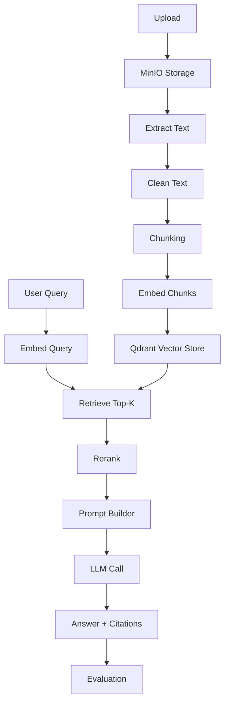

# 09 — Frontend UI Design

Frontend stack:

```text
Next.js + React + Tailwind CSS + shadcn/ui + React Flow
```

## Main pages

```text
/login
/dashboard
/documents
/documents/[documentId]
/chat
/evaluations
/rag-pipeline
/settings
/admin
```

## Layout

```text
----------------------------------------------------
Sidebar
  - Dashboard
  - Documents
  - Chat
  - Evaluations
  - RAG Pipeline
  - Settings

Main Content
  - Page header
  - Main interaction
  - Secondary details panel
----------------------------------------------------
```

## Dashboard page

Purpose:

- Show system overview.
- Show document status.
- Show recent questions.
- Show usage and quality metrics.

Cards:

```text
Total Documents
Indexed Documents
Total Chunks
Average Confidence
Average Latency
Failed Jobs
```

## Documents page

Features:

- Upload PDF/TXT/DOCX.
- Show upload progress.
- Show processing status.
- Show document list.
- Delete/re-index document.
- Filter by status.

Table columns:

```text
Filename
Type
Status
Pages
Chunks
Uploaded By
Created At
Actions
```

## Document detail page

Sections:

1. Metadata.
2. Processing status.
3. Extracted pages preview.
4. Chunks preview.
5. Qdrant vector status.
6. Related chat questions.

## Chat page

Main design:

```text
----------------------------------------------------
Left panel:
  Document selector
  Top-k setting
  Reranking toggle
  Model selector

Center:
  Chat messages

Right panel:
  Citations
  Retrieved chunks
  Confidence details
----------------------------------------------------
```

## Chat response UI

Display:

```text
Answer

Confidence: 0.87 High

Sources:
1. employee_policy.pdf — page 4
   "Employees are entitled to 20 paid leave days..."

2. hr_handbook.pdf — page 8
   "Leave requests must be approved..."
```

## Evaluation page

Features:

- Create evaluation set.
- Add test questions.
- Run evaluation.
- View metric dashboard.
- Inspect failed examples.

Metrics:

```text
Retrieval Hit Rate
Context Precision
Context Recall
Faithfulness
Answer Relevance
Citation Accuracy
Refusal Accuracy
Average Latency
Average Cost
```

## RAG pipeline explorer

Route:

```text
/rag-pipeline
```

Purpose:

Show the full RAG workflow as a clickable interactive diagram.

Use React Flow.

## RAG pipeline explorer diagram



## Pipeline node details

When user clicks a node, show a side panel.

### Upload node

Show:

- Filename.
- File size.
- File type.
- MinIO bucket.
- Object key.
- Upload timestamp.

### Extract node

Show:

- Extractor used.
- Number of pages.
- Character count.
- Failed pages.
- Extraction logs.

### Chunking node

Show:

- Chunking method.
- Chunk size.
- Overlap.
- Number of chunks.
- Average token count.

### Embedding node

Show:

- Embedding model.
- Number of chunks embedded.
- Token count.
- Cost estimate.
- Retry count.

### Qdrant node

Show:

- Collection name.
- Vector count.
- Payload fields.
- Index version.
- Search filters.

### Retrieve node

Show:

- Query.
- Top-k.
- Similarity scores.
- Retrieved chunks.

### Rerank node

Show:

- Reranker type.
- Before ranking.
- After ranking.
- Final selected chunks.

### Prompt node

Show:

- Prompt template.
- Context size.
- Included chunks.
- Safety rules.

### LLM node

Show:

- Model name.
- Latency.
- Input tokens.
- Output tokens.
- Cost.
- Raw response preview.

### Answer node

Show:

- Final answer.
- Citations.
- Confidence score.
- Not-found status.

### Evaluation node

Show:

- Retrieval score.
- Faithfulness.
- Citation accuracy.
- Answer relevance.

## React component structure

```text
frontend/
  app/
    dashboard/page.tsx
    documents/page.tsx
    documents/[id]/page.tsx
    chat/page.tsx
    evaluations/page.tsx
    rag-pipeline/page.tsx

  components/
    layout/AppShell.tsx
    documents/UploadDropzone.tsx
    documents/DocumentTable.tsx
    chat/ChatWindow.tsx
    chat/CitationPanel.tsx
    chat/ConfidenceBadge.tsx
    pipeline/RagPipelineCanvas.tsx
    pipeline/PipelineNode.tsx
    pipeline/NodeDetailsPanel.tsx
    evaluation/EvaluationDashboard.tsx

  lib/
    api.ts
    auth.ts
    types.ts
```

## API client example

```typescript
export async function askQuestion(payload: {
  chat_session_id?: string;
  question: string;
  document_ids?: string[];
  top_k?: number;
  rerank?: boolean;
}) {
  const response = await fetch(`${process.env.NEXT_PUBLIC_API_URL}/chat`, {
    method: "POST",
    headers: {
      "Content-Type": "application/json",
      Authorization: `Bearer ${await getAccessToken()}`
    },
    body: JSON.stringify(payload)
  });

  if (!response.ok) {
    throw new Error("Failed to ask question");
  }

  return response.json();
}
```

## UX recommendations

1. Always show document processing status.
2. Disable chat until at least one document is indexed.
3. Show citation snippets beside the answer.
4. Show low-confidence warnings.
5. Show clear not-found answers.
6. Let users inspect retrieved chunks.
7. Let users choose documents for a query.
8. Add an admin/debug mode for retrieval inspection.
