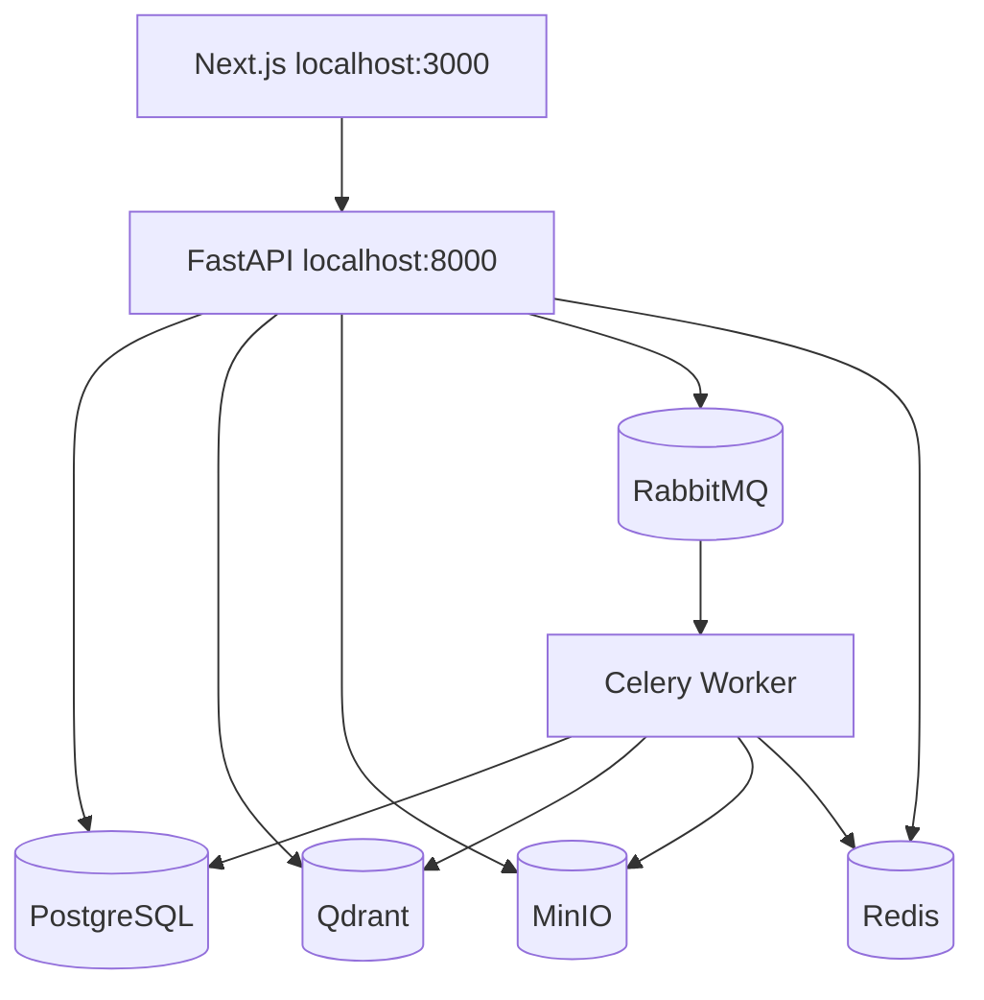
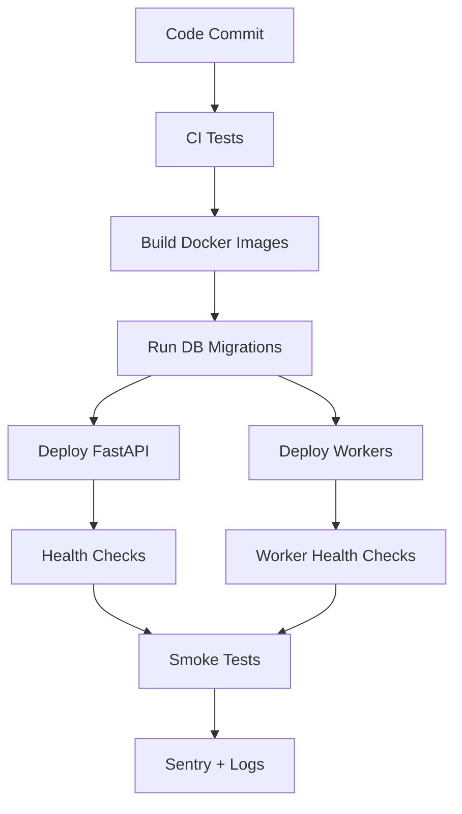

# 10 — Deployment and Docker

## Local development architecture



## Recommended services

```text
frontend       Next.js dev server or containerized Next.js service
api            FastAPI container
worker         Celery worker container
postgres       PostgreSQL
qdrant         Qdrant vector database
minio          MinIO object storage
rabbitmq       RabbitMQ broker
redis          Redis cache
```

## Example Docker Compose

```yaml
version: "3.9"

services:
  api:
    build:
      context: ./backend
    command: uvicorn app.main:app --host 0.0.0.0 --port 8000 --reload
    ports:
      - "8000:8000"
    env_file:
      - .env
    depends_on:
      - postgres
      - qdrant
      - minio
      - rabbitmq
      - redis
    volumes:
      - ./backend:/app

  worker:
    build:
      context: ./backend
    command: celery -A app.workers.celery_app worker --loglevel=INFO
    env_file:
      - .env
    depends_on:
      - postgres
      - qdrant
      - minio
      - rabbitmq
      - redis
    volumes:
      - ./backend:/app

  postgres:
    image: postgres:16
    environment:
      POSTGRES_DB: rag_app
      POSTGRES_USER: postgres
      POSTGRES_PASSWORD: postgres
    ports:
      - "5432:5432"
    volumes:
      - postgres_data:/var/lib/postgresql/data

  qdrant:
    image: qdrant/qdrant:latest
    ports:
      - "6333:6333"
      - "6334:6334"
    volumes:
      - qdrant_data:/qdrant/storage

  minio:
    image: minio/minio:latest
    command: server /data --console-address ":9001"
    environment:
      MINIO_ROOT_USER: minioadmin
      MINIO_ROOT_PASSWORD: minioadmin
    ports:
      - "9000:9000"
      - "9001:9001"
    volumes:
      - minio_data:/data

  rabbitmq:
    image: rabbitmq:3-management
    ports:
      - "5672:5672"
      - "15672:15672"

  redis:
    image: redis:7
    ports:
      - "6379:6379"

volumes:
  postgres_data:
  qdrant_data:
  minio_data:
```

## Backend Dockerfile

```dockerfile
FROM python:3.12-slim

WORKDIR /app

RUN apt-get update && apt-get install -y \
    build-essential \
    curl \
    && rm -rf /var/lib/apt/lists/*

COPY requirements.txt .

RUN pip install --no-cache-dir -r requirements.txt

COPY . .

CMD ["uvicorn", "app.main:app", "--host", "0.0.0.0", "--port", "8000"]
```

## Backend requirements

```text
fastapi
uvicorn[standard]
pydantic
pydantic-settings
sqlalchemy
asyncpg
alembic
celery
redis
pika
boto3
qdrant-client
pymupdf
python-docx
openai
ragas
sentry-sdk
python-multipart
tenacity
tiktoken
```

## Frontend deployment

Recommended:

```text
Self-hosted Next.js container behind Nginx or Traefik
```

Frontend env vars:

```env
NEXT_PUBLIC_API_URL=https://api.yourdomain.com
NEXT_PUBLIC_AUTH_PROVIDER=clerk
NEXT_PUBLIC_CLERK_PUBLISHABLE_KEY=
```

## Backend deployment options

### Option A: Single VM with Docker Compose

Best for first production launch.

- Deploy API, workers, PostgreSQL, Qdrant, MinIO, RabbitMQ, Redis on one VM.
- Use Traefik or Nginx as reverse proxy.
- Use Let's Encrypt TLS.
- Back up PostgreSQL and MinIO.

### Option B: Managed services

Better for serious production.

```text
API:        AWS ECS / Fly.io / Render / Railway
Workers:    ECS worker service / Fly worker
Postgres:   Managed Postgres
Qdrant:     Qdrant Cloud
MinIO:      Managed S3-compatible object storage or AWS S3
RabbitMQ:   CloudAMQP
Redis:      Upstash / Redis Cloud
Frontend:   Container platform (ECS / Fly.io / Render / Railway / Kubernetes)
```

## Production environment variables

```env
ENVIRONMENT=production
DATABASE_URL=
QDRANT_URL=
QDRANT_API_KEY=
MINIO_ENDPOINT=
MINIO_ACCESS_KEY=
MINIO_SECRET_KEY=
MINIO_BUCKET=documents
RABBITMQ_URL=
REDIS_URL=
OPENAI_API_KEY=
OPENAI_EMBEDDING_MODEL=text-embedding-3-small
OPENAI_LLM_MODEL=gpt-5.4-mini
SENTRY_DSN=
```

## Release checklist

Before deployment:

- Run unit tests.
- Run API integration tests.
- Run database migrations.
- Verify Qdrant collection exists.
- Verify MinIO bucket exists.
- Verify RabbitMQ and worker connectivity.
- Verify Redis connectivity.
- Verify auth token validation.
- Verify file upload size limits.
- Verify Sentry events.
- Verify structured logs.
- Run sample RAG evaluation set.

## Backup strategy

Back up:

- PostgreSQL database.
- MinIO object storage.
- Qdrant snapshots.
- Environment secret store.

Minimum schedule:

```text
PostgreSQL: daily backup
MinIO: daily bucket replication or backup
Qdrant: daily snapshot
```

## Scaling strategy

Scale these independently:

| Component | Scaling method |
|---|---|
| FastAPI | More API containers |
| Celery workers | More worker containers |
| PostgreSQL | Managed DB, read replicas later |
| Qdrant | Dedicated node/cluster |
| MinIO | Distributed MinIO or managed S3 |
| RabbitMQ | Managed RabbitMQ |
| Redis | Managed Redis |

## Production readiness diagram


