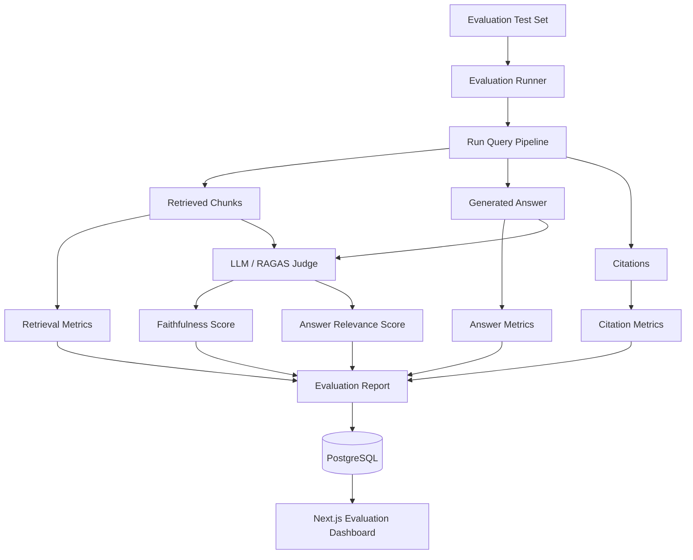
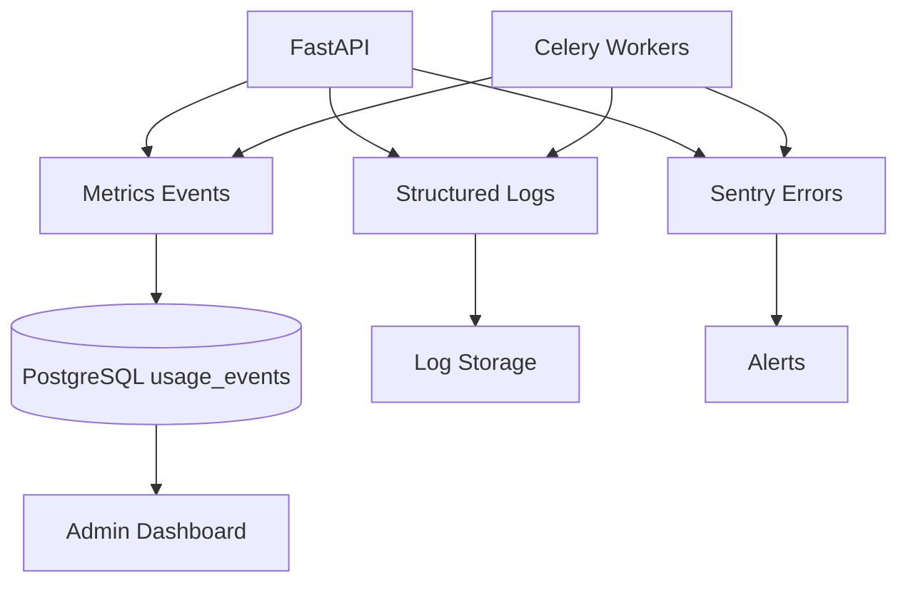

# 12 — Evaluation and Monitoring

## Why evaluation matters

A RAG system can fail in several ways:

1. Retrieval returns wrong chunks.
2. Retrieval returns incomplete context.
3. The LLM ignores context.
4. The answer is unsupported.
5. The citations are wrong.
6. The system answers when it should say "not found".
7. Latency or cost is too high.

Evaluation should test each part separately.

## Evaluation architecture



## Evaluation dataset format

```json
[
  {
    "question": "How many paid leave days are available?",
    "expected_answer": "20 paid leave days",
    "expected_document_id": "uuid",
    "expected_filename": "employee_policy.pdf",
    "expected_page_number": 4,
    "tags": ["hr", "leave"]
  }
]
```

## Metrics

### Retrieval hit rate

Checks whether expected document/page appears in top-k.

```text
hit = expected_source in retrieved_sources
```

### Context precision

Measures whether retrieved chunks are relevant.

### Context recall

Measures whether enough relevant context was retrieved.

### Faithfulness

Checks whether the generated answer is supported by retrieved context.

### Answer relevance

Checks whether the answer addresses the user question.

### Citation accuracy

Checks whether cited chunks support the answer.

### Refusal accuracy

Checks whether the system says "not found" when the answer is absent.

### Latency

Track:

```text
embedding latency
Qdrant retrieval latency
reranking latency
LLM latency
total latency
```

### Cost

Track:

```text
embedding tokens
LLM input tokens
LLM output tokens
estimated cost
```

## Custom evaluation example

```python
def retrieval_hit_rate(results, expected_document_id, expected_page_number):
    for item in results:
        if (
            item["document_id"] == expected_document_id
            and item["page_number"] == expected_page_number
        ):
            return 1.0
    return 0.0
```

## RAGAS evaluation

Use RAGAS for:

- Faithfulness.
- Answer relevancy.
- Context precision.
- Context recall.

Keep custom metrics too because production systems need business-specific checks.

## Evaluation dashboard

Show:

```text
Overall Score
Retrieval Hit Rate
Faithfulness
Citation Accuracy
Average Confidence
Average Latency
Average Cost
Failed Questions
Low-Confidence Questions
Regression Compared to Last Run
```

## Monitoring architecture



## Structured logging events

## Base structured log schema

All API and worker logs should follow the same base schema:

```json
{
  "event": "api.request | task.start | task.success | task.retry | task.failure | domain_event_name",
  "timestamp": "ISO-8601 UTC",
  "level": "debug|info|warning|error|critical",
  "logger": "api.access | api.exception | worker.tasks | events.*",
  "request_id": "optional request correlation id",
  "user_id": "optional user id",
  "organization_id": "optional organization id",
  "document_id": "optional document id",
  "job_id": "optional job/evaluation/task id",
  "endpoint": "optional HTTP path",
  "status_code": "optional HTTP or task status",
  "latency_ms": "optional request/task duration",
  "error": "optional short error name/message",
  "exception": "optional stack trace for exceptions"
}
```

Notes:

- `request_id` should be echoed as `X-Request-ID` in API responses.
- `latency_ms` is always emitted for API access logs.
- Secret values must be redacted (API keys, tokens, passwords, secrets).

### document_uploaded

```json
{
  "event": "document_uploaded",
  "document_id": "uuid",
  "organization_id": "uuid",
  "filename": "policy.pdf",
  "file_type": "pdf",
  "size_bytes": 1234567
}
```

### document_indexed

```json
{
  "event": "document_indexed",
  "document_id": "uuid",
  "organization_id": "uuid",
  "page_count": 24,
  "chunk_count": 92,
  "duration_ms": 18400
}
```

### query_answered

```json
{
  "event": "query_answered",
  "organization_id": "uuid",
  "chat_session_id": "uuid",
  "message_id": "uuid",
  "top_similarity": 0.91,
  "confidence_score": 0.87,
  "latency_ms": 1450,
  "model_name": "gpt-5.4-mini"
}
```

### evaluation_completed

```json
{
  "event": "evaluation_completed",
  "evaluation_run_id": "uuid",
  "retrieval_hit_rate": 0.86,
  "faithfulness": 0.82,
  "citation_accuracy": 0.79,
  "average_latency_ms": 1520
}
```

## Sentry alerts

Create alerts for:

- API error rate above threshold.
- Celery task failure spike.
- LLM API failures.
- Qdrant connection errors.
- MinIO upload failures.
- Database connection pool exhaustion.
- High latency.
- High cost.

## Production SLOs

Suggested targets:

| Metric | Target |
|---|---|
| API availability | 99.5%+ |
| Chat p95 latency | < 5 seconds |
| Document indexing success | > 98% |
| Retrieval hit rate | > 85% on eval set |
| Citation accuracy | > 80% |
| Failed task rate | < 2% |
| Not-found correctness | > 90% |

## Continuous evaluation

Run evaluations:

```text
On every major prompt change
On every retrieval setting change
On every embedding model change
Nightly on a fixed test set
Before production deployment
```

## Regression policy

Do not deploy if:

- Retrieval hit rate drops more than 5%.
- Citation accuracy drops more than 5%.
- Faithfulness drops below threshold.
- Average latency doubles.
- Cost per answer increases unexpectedly.

## Feedback loop

Allow users to rate answers:

```text
👍 helpful
👎 not helpful
Citation incorrect
Answer not in document
Answer incomplete
```

Store feedback in PostgreSQL and use it to improve:

- Test questions.
- Prompts.
- Chunking.
- Retrieval filters.
- Reranking.
