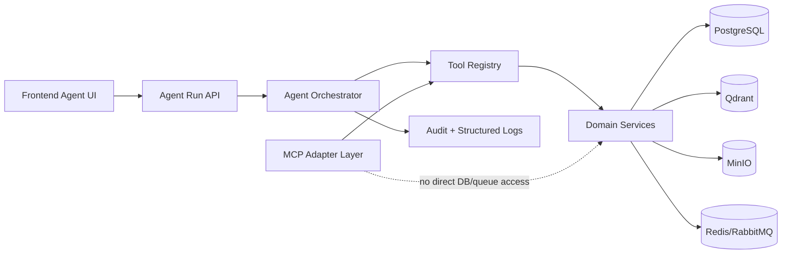
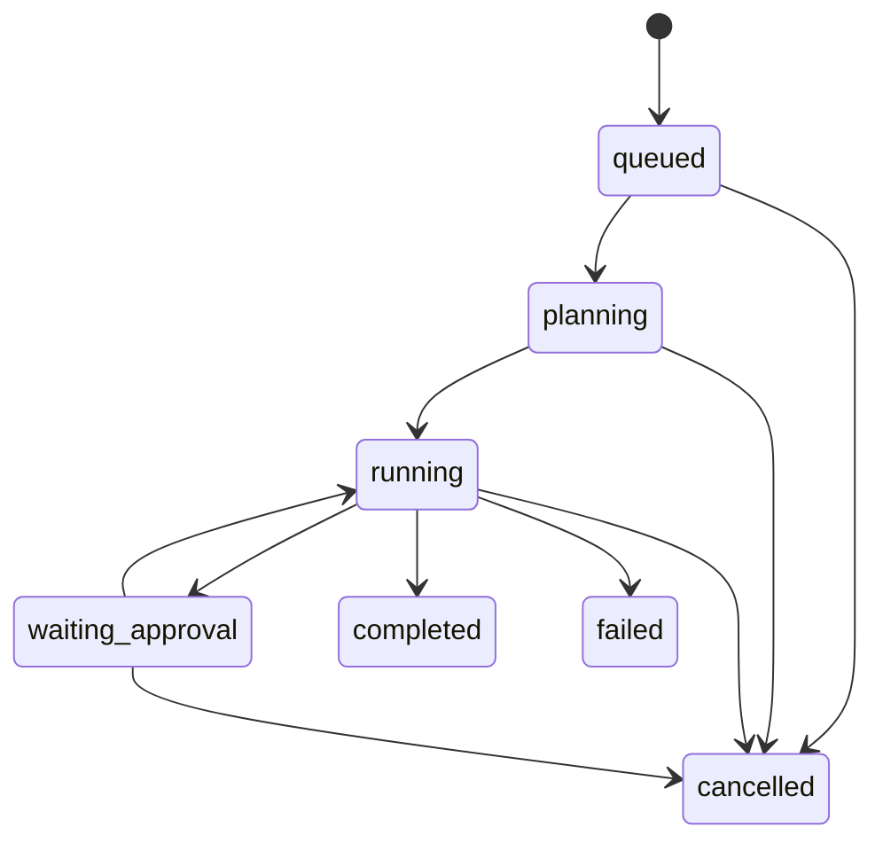

# 13. Agentic Architecture and Capability Model

## Objective

Define the Rudix agent runtime shape before exposing autonomous workflows:

- capability model and tool boundaries
- state model for agent runs and tool calls
- read-only vs side-effect policy
- budgets, redaction, and safe error behavior
- MCP separation while sharing reusable domain internals

This document describes architecture and guardrails. It does not require MCP at runtime for core API flows.

## Architecture Overview



## Core Concepts

### ToolSpec

`ToolSpec` defines:

- name, capability label, and description
- effect policy (`read_only` or `side_effect`)
- required roles
- organization scope requirement
- allowed surfaces (`api`, `mcp`)
- budget limits and redaction policy

### ToolCall

`ToolCall` includes:

- run ID and call ID
- tool name
- organization and user context
- arguments payload
- requested effect policy (optional)
- idempotency key (required for side-effect tools)

### ToolResult

`ToolResult` includes:

- success/failure outcome
- redacted output payload
- safe error object with code, message, request ID, retryability
- optional latency

## Capability Model

Initial capability map for existing Rudix internals:

| Capability | Candidate tool | Effect | Surfaces |
|---|---|---|---|
| Document read | `documents.list`, `documents.get`, `documents.chunks.list` | read_only | api, mcp |
| Document intelligence (read-only) | `search_documents`, `get_document_detail`, `list_document_chunks` | read_only | api, mcp |
| Grounded read-only reasoning | `answer_from_context`, `summarize_document`, `compare_documents` | read_only | api, mcp |
| Chat retrieval/answer | `chat.answer` | side_effect | api |
| Evaluation execution | `evaluations.run` | side_effect | api |
| Pipeline observability | `pipeline.runs.get` | read_only | api, mcp |
| Document lifecycle mutation | `documents.reindex`, `documents.delete` | side_effect | api |

## Read-only vs Side-effect Policy

1. Read-only tools may be exposed on API and MCP surfaces.
2. Side-effect tools remain API-only by default.
3. Side-effect calls require:
   - idempotency key
   - explicit authorization check
   - org-scope check
4. Side-effect retries must respect safe retry semantics and mutation idempotency.

## State Model



## Persistence and Trace Schema (F99)

Agent execution traces are persisted in organization-scoped tables:

- `agent_runs`
- `agent_steps`
- `agent_tool_calls`
- `agent_approvals`

Design constraints:

1. Every table carries `organization_id` and must be queried with org-scoped filters.
2. Status fields are constrained with explicit allowed values.
3. Inputs/outputs/errors are stored as sanitized JSON payloads only.
4. Idempotency keys are not stored in plaintext for tool calls (hashed at persistence boundary).
5. Indexes support common audit/ops reads:
   - organization + status
   - organization + user + created time
   - run + sequence/status

## Security and Threat Model

### Enforced Controls

- org isolation at tool-call authorization (`principal.organization_id == call.organization_id`)
- role checks per `ToolSpec.required_roles`
- no raw secret/token/document content in error/log payloads
- explicit redaction of sensitive keys and content-bearing fields

### Threats and Mitigations

| Threat | Mitigation |
|---|---|
| Cross-organization data access | organization-scoped authorization gate before tool execution |
| Privilege escalation via tool misuse | role-gated `ToolSpec` checks |
| Secret leakage in errors/logs | metadata sanitization + explicit key redaction |
| Unsafe replay of mutations | required idempotency keys for side-effect tools |
| Resource abuse | per-tool budgets (calls, payload sizes, timeout, retries) |

## Budgets and Safe Errors

Per-tool budget controls:

- max calls per run
- max input bytes
- max output bytes
- timeout (ms)
- retry attempts

Validation and execution errors must return safe errors only:

- `validation_failed`
- `authorization_failed`
- `approval_required`
- `budget_exceeded`
- `tool_unavailable`
- `internal_error`

Safe errors may contain a request ID and sanitized details, but never secrets or raw protected content.

## Human Approval and Safety Guardrails (F105)

### Approval Flow

1. Tools marked `approval_required=true` cannot execute without an approved `AgentApproval` record.
2. If a required approval is missing, the executor creates a `pending` approval and returns a safe `approval_required` error.
3. Runtime transitions run/step to `waiting_approval` and exposes pending approval metadata through run detail.
4. Owners/admins decide pending approvals via:
   - `POST /api/v1/agent/runs/{run_id}/approvals/{approval_id}/decision`
   - body: `{ "status": "approved" | "rejected", "reason"?: "...", "decision_payload"?: { ... } }`
5. Approval request/decision events are audit logged:
   - `agent.approval.requested`
   - `agent.approval.approved`
   - `agent.approval.rejected`

### Prompt-Injection Defenses

Runtime applies a heuristic request guard before planning/execution:

- blocks known instruction-override patterns in objective/question/query
- returns safe `prompt_injection_blocked` runtime error without echoing raw malicious prompt text

### Document-Sourced Instruction Blocking

When observing document search output, runtime only consumes validated UUID document IDs and indexed status for downstream selection.
Instruction-like document payload text is treated as untrusted signal and never used as executable tool directives.

## MCP Separation Model

MCP is an adapter surface, not the core execution boundary:

1. Core agent contracts (`ToolSpec`, `ToolCall`, `ToolResult`) live in backend domain code.
2. API runtime and MCP adapters both call the same domain services and policy checks.
3. MCP tools do not bypass authz, org isolation, budget checks, or redaction.
4. MCP exposure is configured per-tool via `ToolSpec.surfaces`.

## Internal Execution Contract (F100)

Rudix uses one internal tool layer for both agent runtime and MCP adapters:

1. `ToolRegistry` is the allowlist boundary. Unknown tools are rejected as unavailable.
2. `AgentToolExecutor` is the execution boundary and enforces:
   - per-tool authorization and org isolation
   - approval requirement for tools marked `approval_required=true`
   - call budget limits (`max_calls_per_run`, payload size, timeout)
   - structured `ToolResult` success/failure output
3. Execution wrappers include timeout handling, safe error mapping, and audit events.
4. Side-effect tools must include idempotency keys; selected side-effect tools can additionally require approval IDs.
5. Persisted tool-call traces store sanitized payloads and hashed idempotency keys only.

## Planner/Executor Loop (F102)

`AgentRuntime` implements a persisted plan-act-observe loop:

1. Create `agent_runs` row in `planning` state with runtime budgets.
2. Build a typed tool plan (`PlannedToolSelection`) from objective and mode.
3. Persist planning step and transition run to `running`.
4. For each planned step:
   - enforce runtime and budget constraints (steps/runtime/tool calls/tokens/cost)
   - check cancellation signal and persisted cancellation status
   - execute tool via `AgentToolExecutor`
   - persist step outcome (`completed` or `failed`) with sanitized outputs/metrics
   - accumulate usage/cost from structured tool debug usage fields
5. Complete run with final outcome (answer + citations + confidence) or fail/cancel with safe error payload.

This loop reuses the same org authorization, redaction, and audit boundaries as the tool executor.

## Observability, Audit, and Metrics (F106)

Agentic execution emits three organization-scoped usage event types:

- `agent.runtime`
- `agent.tool_call`
- `agent.approval`

Runtime and executor persist only sanitized operational metadata:

- run/step/tool/approval status
- step and tool-call counts
- token and cost totals
- confidence score/category
- safe error code
- request correlation ID

Raw prompt text, document body, tokens/credentials, and full answer text are not written into usage/audit payloads.

### Admin diagnostics

Owners/admins can query:

- `GET /api/v1/admin/agent/diagnostics`

The response includes:

- run lifecycle counters (`completed`, `failed`, `waiting_approval`, `cancelled`)
- tool-call success/failure metrics
- approval requested/approved/rejected metrics
- total tokens, total cost, and average confidence
- error-code breakdown (`errors_by_code`)
- grouped agent audit action counts (`audit_actions`)

Diagnostics are organization-scoped and reuse admin role guards.

## Configuration Example

```env
FEATURE_ENABLE_AGENTS=false
AGENT_MAX_STEPS=12
AGENT_MAX_PARALLEL_TOOL_CALLS=4
AGENT_TOOL_MAX_CALLS_PER_RUN=30
AGENT_TOOL_TIMEOUT_MS=8000
AGENT_TOOL_MAX_INPUT_BYTES=32768
AGENT_TOOL_MAX_OUTPUT_BYTES=65536
AGENT_TOOL_MAX_RETRY_ATTEMPTS=1
AGENT_PROMPT_INJECTION_GUARD_ENABLED=true
AGENT_DOCUMENT_INSTRUCTION_GUARD_ENABLED=true
```

## Testing Expectations

Minimum automated coverage:

1. successful tool-call contract validation and redacted success output
2. validation failure (mismatched tool spec or missing idempotency key)
3. authorization failure (role check and cross-org isolation)
4. safe error redaction behavior for nested sensitive payloads
