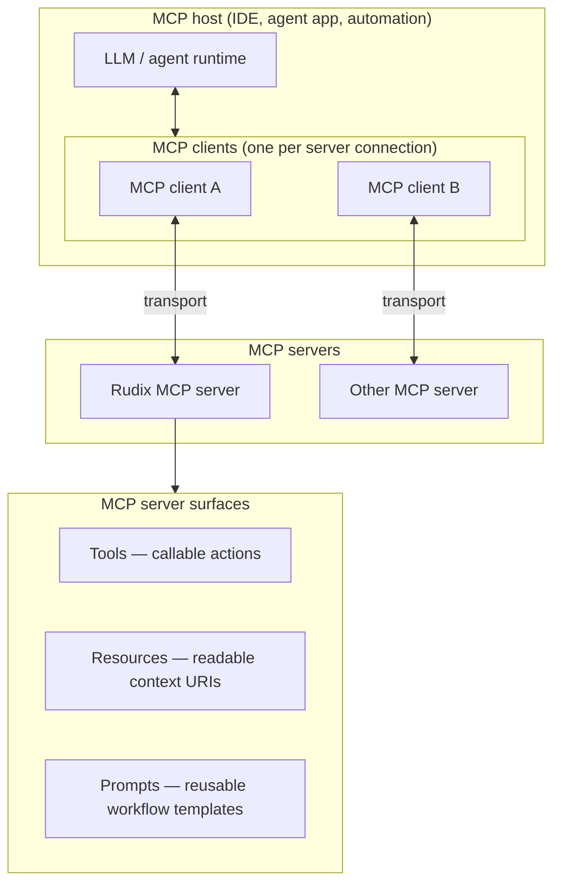
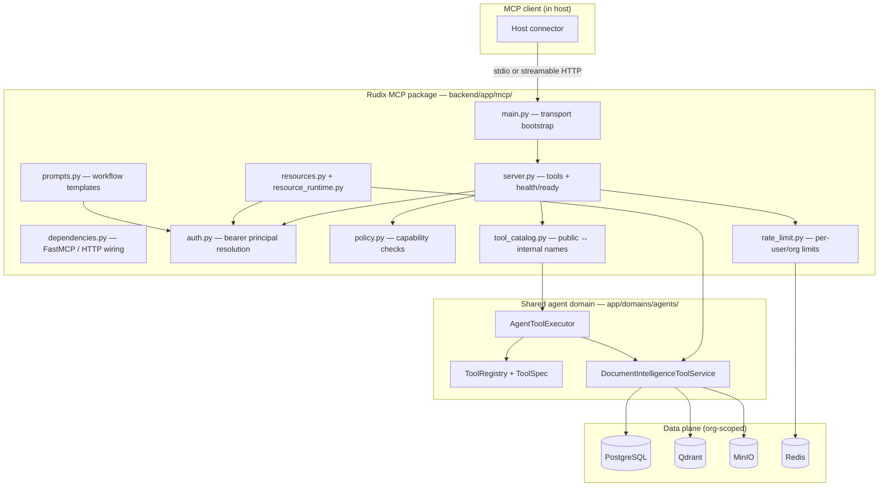
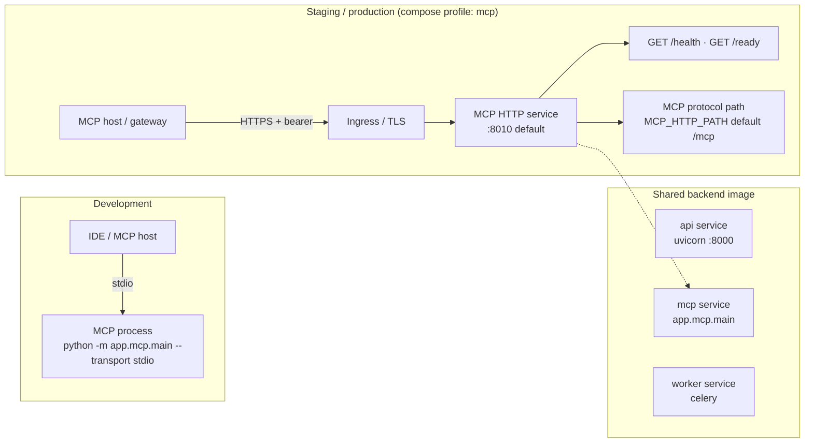
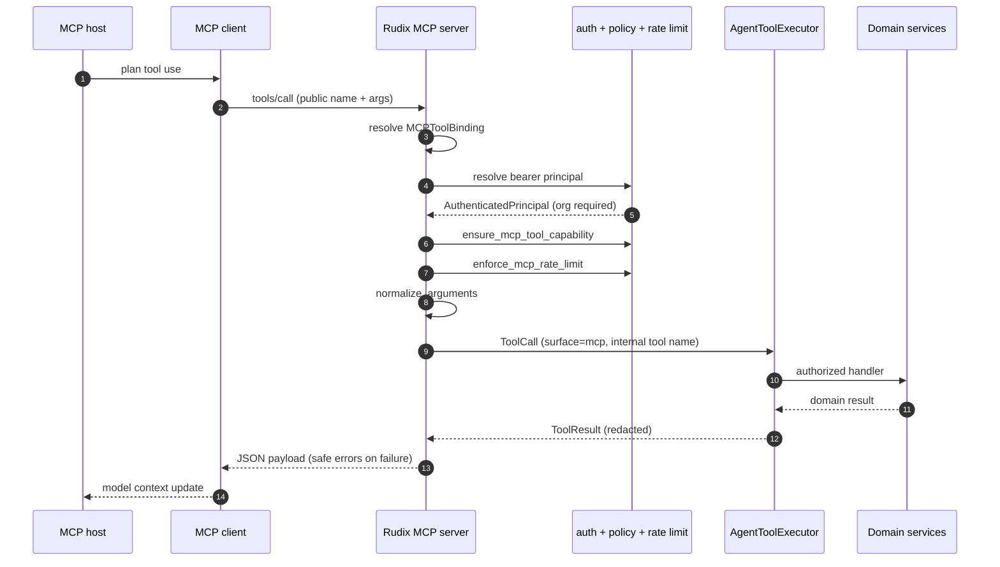
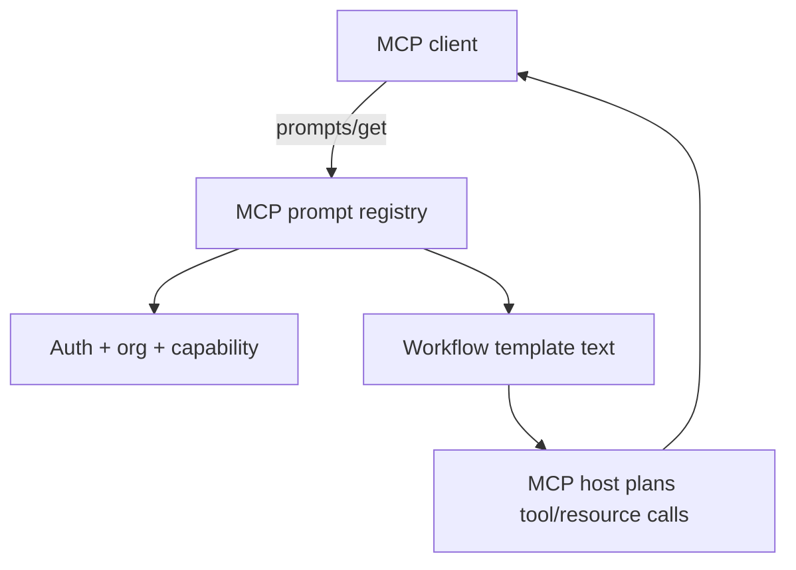
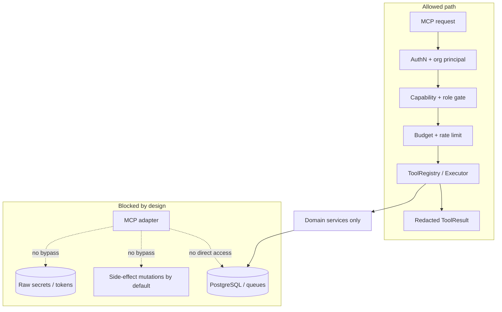

# 15. Standalone MCP Server Deployment Mode

- **Owner:** Platform / Backend
- **Status:** Approved
- **Last Updated:** 2026-05-23
- **Related Docs:** [13_AGENTIC_ARCHITECTURE_AND_CAPABILITY_MODEL.md](./13_AGENTIC_ARCHITECTURE_AND_CAPABILITY_MODEL.md), [01_ARCHITECTURE_OVERVIEW.md](./01_ARCHITECTURE_OVERVIEW.md), [11_SECURITY_AND_PRODUCTION_CHECKLIST.md](./11_SECURITY_AND_PRODUCTION_CHECKLIST.md)

## Objective

Expose Rudix capabilities to MCP clients through a standalone server package without coupling MCP transport to the REST chat API runtime.

## Reference: MCP architecture and components

The diagrams in this document follow the standard **Model Context Protocol (MCP)** mental model (host, client, server, transports, tools, resources, prompts) described in this external reference:

**[MCP Architecture and Components (ChatGPT share)](https://chatgpt.com/share/6a117df8-0808-83eb-9e15-78dff162d648)**

Rudix implements that model as a **read-only, organization-scoped adapter** on top of shared domain tool contracts. For agent runtime boundaries and capability tables, see [13_AGENTIC_ARCHITECTURE_AND_CAPABILITY_MODEL.md](./13_AGENTIC_ARCHITECTURE_AND_CAPABILITY_MODEL.md).

---

## Standard MCP architecture (conceptual)

At the protocol level, MCP separates the **host application** from **servers** that expose context and actions to the model.



| MCP component | Role | Rudix implementation |
|---|---|---|
| **Host** | Runs the agent/LLM and orchestrates client connections | Cursor, Claude Desktop, custom agents, CI bots |
| **Client** | Speaks MCP over a transport; forwards tool/resource/prompt requests | Provided by the host SDK |
| **Server** | Advertises capabilities and executes protocol operations | `backend/app/mcp/server.py` (FastMCP) |
| **Transport** | Wire protocol between client and server | `stdio` (dev) or `streamable_http` (network) via `app/mcp/main.py` |
| **Tools** | Structured actions with JSON arguments and results | Public MCP tools → `AgentToolExecutor` |
| **Resources** | Addressable, read-only context (often URI templates) | `rudix://…` templates → `MCPResourceRuntime` |
| **Prompts** | Parameterized workflow instructions for the host | `backend/app/mcp/prompts.py` |

---

## Rudix MCP component map

MCP is a **transport adapter**, not a second business-logic stack. Domain rules live under `app/domains/agents` and shared services; MCP modules only handle protocol, auth, rate limits, and mapping.



Entry points:

- `backend/app/mcp/dependencies.py` — SDK and HTTP integration
- `backend/app/mcp/auth.py` — authentication
- `backend/app/mcp/server.py` — tool registration and execution
- `backend/app/mcp/main.py` — process entry (`python -m app.mcp.main`)

Shared contracts (same as API/agent runtime):

- `ToolSpec`, `ToolCall`, `ToolResult`
- `ToolRegistry`, `AgentToolExecutor`

---

## Deployment topology

MCP runs as a **separate process** from the REST API. Both can share the backend container image but use different commands and ports.



### Transport modes

| Mode | Use case | Rudix constraint |
|---|---|---|
| `streamable_http` | Network deployment, remote agents | Default for compose/staging/production |
| `stdio` | Local IDE integration | **Blocked** in `staging` and `production` |

`stdio` requires dev principal settings (`MCP_DEV_PRINCIPAL_*`) when bearer auth is relaxed.

### Disabled-by-default behavior

MCP is feature-gated:

- `FEATURE_ENABLE_MCP=false` by default

If disabled, MCP startup exits safely and readiness reports the feature gate as not enabled.

---

## Tool call flow (sequence)

Every MCP tool call follows the same guardrails as API-side tool execution: authenticate, scope to organization, check capability and rate limit, validate arguments, execute via `AgentToolExecutor`, return redacted `ToolResult`.



Public MCP tool names and internal mappings:

| Public MCP tool | Internal handler | Effect |
|---|---|---|
| `search_documents` | `search_documents` | read_only |
| `ask_documents` | `answer_from_context` | read_only |
| `get_document_chunks` | `list_document_chunks` | read_only |
| `summarize` | `summarize_document` | read_only |
| `compare` | `compare_documents` | read_only |

Compatibility aliases: `get_document_detail`, `list_document_chunks`, `answer_from_context`, `summarize_document`, `compare_documents`.

`ask_documents` returns a structured grounded payload: `answer`, `citations`, `confidence`, `not_found`.

Side-effect tools (delete, re-index, evaluation runs, etc.) remain **API-only** unless explicitly approved for MCP later.

---

## Resource and prompt surfaces

### Resources (read-only context URIs)

Resources provide **compact, citation-friendly** document context without exposing full raw document text by default.

```mermaid
flowchart LR
  C[MCP client] -->|resources/read| RR[MCPResourceRuntime]
  RR --> AUTH[Auth + org scope]
  RR --> RL[Rate limit]
  RR --> DIS[DocumentIntelligenceToolService]
  DIS --> PG[(PostgreSQL)]
  DIS --> QD[(Qdrant)]

  subgraph URIs["rudix:// URI templates"]
    U1[documents]
    U2[documents/{id}]
    U3[documents/{id}/status]
    U4[documents/{id}/chunks]
    U5[search/{query}]
    U6[citations/{query}]
  end

  C --> URIs
```

Templates:

- `rudix://documents{?status,sort_by,sort_order,limit,offset,query}`
- `rudix://documents/{document_id}`
- `rudix://documents/{document_id}/status`
- `rudix://documents/{document_id}/chunks{?limit,offset}`
- `rudix://search/{query}{?status,sort_by,sort_order,limit,offset}`
- `rudix://citations/{query}{?document_id,top_k,rerank}`

Resource policy:

- Same bearer auth, organization scope, capability mapping, and MCP rate limits as tools
- Server-side pagination caps (`limit` max 50)
- Trimmed query text and truncated snippets

### Prompts (workflow templates)

Prompts do **not** execute business logic. They return validated instructions that guide the host to call safe read-only tools/resources.



Templates:

- `grounded_qa`
- `summarize_workflow`
- `compare_workflow`
- `obligations_action_items`
- `evidence_lookup`

---

## Security and policy boundary

MCP must never bypass organization isolation, role checks, budgets, or redaction.



### Authentication and organization isolation

**HTTP mode:**

- Bearer token from existing auth providers
- Active organization on `AuthenticatedPrincipal`
- Org-scoped execution: `principal.organization_id == call.organization_id`

**Development fallback** (non-production only):

- Optional when `MCP_REQUIRE_BEARER_AUTH=false`
- `MCP_DEV_PRINCIPAL_USER_ID`, `MCP_DEV_PRINCIPAL_ORGANIZATION_ID`, `MCP_DEV_PRINCIPAL_ROLES`

### Capability mapping (least privilege)

Configurable role → capability lists:

- `MCP_CAPABILITIES_OWNER`
- `MCP_CAPABILITIES_ADMIN`
- `MCP_CAPABILITIES_MEMBER`
- `MCP_CAPABILITIES_VIEWER`

Default: MCP stays read-focused; viewer excludes `chat.answer` by default.

### MCP rate limits

Per organization, user, tool, and time window:

- `MCP_RATE_LIMIT_ENABLED`
- `MCP_RATE_LIMIT_WINDOW_SECONDS`
- `MCP_RATE_LIMIT_REQUESTS`

Redis failure behavior follows `RATE_LIMIT_REDIS_FAILURE_MODE`.

### Safety and redaction

Structured `ToolResult` with safe errors only — no raw tokens, secrets, or protected document text in failures.

---

## Runtime endpoints (HTTP mode)

| Endpoint | Purpose |
|---|---|
| `GET /health` | Liveness |
| `GET /ready` | Dependency readiness (DB, Qdrant, SDK, feature flags) |
| `MCP_HTTP_PATH` (default `/mcp`) | MCP protocol |

Default local URL: `http://localhost:8010`

---

## Configuration

| Variable | Purpose |
|---|---|
| `FEATURE_ENABLE_MCP` | Master feature gate |
| `MCP_SERVER_NAME` | Server advertisement name |
| `MCP_TRANSPORT` | `streamable_http` or `stdio` |
| `MCP_HTTP_HOST` / `MCP_HTTP_PORT` / `MCP_HTTP_PATH` | HTTP binding |
| `MCP_REQUIRE_BEARER_AUTH` | Require bearer in HTTP mode |
| `MCP_DEV_PRINCIPAL_*` | Dev-only principal for stdio |

---

## Local commands

From `backend/`:

```bash
make run-mcp-http
make run-mcp-stdio
```

From repository root:

```bash
make up-mcp
make logs-mcp
make down-mcp
```

`up-mcp` uses the compose `mcp` profile so MCP startup is explicit.

---

## Deployment notes

- Staging/production compose includes an optional `mcp` service profile.
- MCP reuses the backend image: `python -m app.mcp.main`.
- Health/readiness use Python `urllib` probes (no `curl` in the runtime image).
- Keep MCP behind authenticated ingress and TLS in remote environments.
- Forward `Authorization` and optional `x-organization-id`; do not log tokens or raw document text.

See also [10_DEPLOYMENT_DOCKER.md](./10_DEPLOYMENT_DOCKER.md) for compose layout and image build details.
