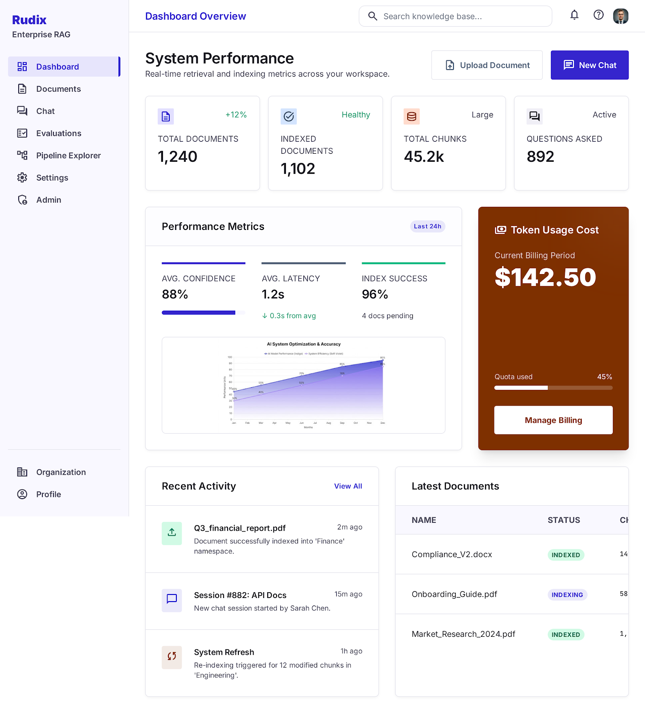

# Frontend

Next.js frontend for Rudix. The current implementation includes an authenticated application shell, login/signup session flows, the Documents workspace at `/documents`, and the Pipeline Explorer at `/rag-pipeline`.

## Stack

- Next.js App Router
- React + TypeScript
- Tailwind CSS v4
- React Flow (`@xyflow/react`)
- TanStack Query
- Zustand
- React Hook Form + Zod
- Vitest + Testing Library
- Playwright

## Implemented Pages

- Public marketing routes (outside the authenticated app shell):
  - `/` landing page
  - `/product`
  - `/solutions`
  - `/security`
  - `/pricing` (configurable/contact-placeholder packaging)
  - `/contact` (validated contact/demo form)
  - `/demo` (alias redirect to `/contact`)
  - `/status`
- `/login` credential-based sign-in form with auth-provider entry points
- `/signup` account creation form with workspace create/join entry points
- `/organization-onboarding` authenticated workspace setup flow (workspace, domain allowlist, access defaults, invites)
- `/onboarding` compatibility redirect to `/organization-onboarding`
- `/forbidden` unauthorized route destination
- `/403` alias route for forbidden destination
- Protected product pages inside the shared shell:
  - `/dashboard`
  - `/documents`
  - `/chat`
  - `/evaluations`
  - `/rag-pipeline` Pipeline Explorer
  - `/settings`
  - `/admin` (owner/admin roles only)
  - `/admin/governance` (owner/admin roles only)

### Shared Shell and Protection

- Reusable authenticated shell with:
  - responsive sidebar and mobile drawer navigation
  - top bar with route context, notifications, help, and profile menus
  - content container shared by all product pages
- Route metadata and role-aware navigation actions for all product routes.
- Protected-route behavior:
  - unauthenticated users are redirected to `/login?next=...`
  - unauthorized users are redirected to `/forbidden`
- Forbidden state behavior:
  - reusable `ForbiddenState` component for inline and full-page authorization failures
  - includes optional support action via environment configuration
  - displays safe trace/request ID values when available from backend responses
- Top bar behavior:
  - profile menu shows safe user and organization context with settings + sign-out actions
  - help menu links to configured docs/support/shortcuts/README resources
  - notifications menu consumes optional backend feed and shows loading, empty, and unavailable states
  - global search command menu (`Cmd/Ctrl + K`) provides:
    - quick page navigation (Dashboard, Documents, Chat, Evaluations, Pipeline Explorer, Settings, Admin when permitted)
    - document search by filename/status from organization-scoped document list data
    - recent chat session shortcuts
    - permission-aware route filtering and helpful empty states
  - menu actions are permission-aware (e.g., admin links only for owner/admin roles)
- Login behavior:
  - validates credentials using React Hook Form + Zod
  - redirects already authenticated users away from `/login`
  - redirects successful sign-in to requested protected route (`next`) or `/dashboard`
  - supports environment-driven SSO and forgot-password links when configured
- Signup behavior:
  - validates name, email, password, workspace mode, and terms acceptance using React Hook Form + Zod
  - supports create-workspace and join-workspace entry points
  - maps duplicate email, weak password, invite-only, and provider/network errors to safe messages
  - redirects successful signup to `/organization-onboarding` or `/dashboard` based on signup result state
- Organization onboarding behavior:
  - requires authenticated session and redirects unauthenticated users to `/login?next=/organization-onboarding`
  - redirects already-onboarded sessions to `/dashboard`
  - validates workspace name, optional domain allowlist, default access settings, and invite emails/roles
  - supports draft save/resume through backend endpoints when configured, with local fallback
  - completes onboarding by creating/updating organization context and routing to `/dashboard`
- Documents page behavior:
  - upload dropzone for `pdf`, `txt`, and `docx` files with permission-aware controls
  - status-aware document table (filename, type, status, page count, chunk count, created timestamp)
  - async delete and re-index actions with role-based enablement
  - polling while documents are in transitional states (`uploaded`, `processing`, `deleting`)
  - detail and chunk preview inspector with loading/empty/error states
- Dashboard page behavior:
  - KPI cards for total documents, indexed documents, total chunks, questions asked, average confidence, average latency, indexing success, and estimated cost (admin/owner only)
  - data sourced from typed document, chat, and admin usage clients with fallback handling where backend metrics are unavailable
  - admin-only usage window selector (7d / 30d / 90d) for `/admin/usage` aggregation when enabled
  - explicit loading/error states with retry actions for each KPI card
  - empty state with document/chat call-to-actions when no activity exists
- Chat page behavior:
  - supports one-shot RAG mode and explicit agentic mode toggle for plan-act-observe execution
  - agentic mode calls `/agent/runs` with typed payloads and renders final cited answer in-thread
  - context panel includes safe agent timeline (status, budgets, stop reason, and step durations)
  - step-level raw payloads are intentionally hidden from UI to avoid sensitive data exposure
- Evaluations page behavior:
  - modular dashboard layout with header/actions, KPI cards, run filters, run list, run detail, and case-inspection sections
  - primary CTA for starting a run and secondary CTA for evaluation set creation (owner/admin visibility)
  - run filters for status, dataset, owner, date range, search query, and sort order
  - run detail section with run metrics, baseline-comparison placeholder, failed-case focus, citation/source links when available, and pipeline deep-linking
  - test-case section with dataset search, test-case filters/sort, and permission-aware add-case flow
  - resilient fallback rendering for missing backend fields (for example comparison deltas, cost/owner fields, or citation payloads)
  - explicit loading, empty, unavailable-backend, error, and forbidden states with safe request-id rendering
- Settings page behavior:
  - profile and organization context sections for authenticated users
  - security section shows safe auth diagnostics only (provider and token availability flags)
  - preferences form validates and supports save/discard flow for default `top_k`, rerank, developer mode, and notification choices
  - optional backend persistence for preferences (`NEXT_PUBLIC_SETTINGS_PREFERENCES_LOAD_URL`, `NEXT_PUBLIC_SETTINGS_PREFERENCES_SAVE_URL`) with local fallback
  - admin-only controls section is permission-aware for non-admin users
- Admin page behavior:
  - usage summary cards for events, tokens, cost, confidence, and latency
  - usage trend table sourced from `/admin/usage` with date-range filters
  - recent activity feed sourced from `/admin/audit-logs` with optional user/action filters
  - owner/admin-only access with forbidden-state fallback when authorization changes
  - quick links to documents, chat, evaluations, and pipeline explorer
- Admin governance page behavior:
  - organization-scoped policy controls for agentic mode, MCP exposure, tool allowlists, and runtime budgets
  - external MCP server policy form with side-effect warning acknowledgment flow
  - MCP endpoint status panel showing configured transport, auth, and rate-limit posture
  - typed API client integration with `/admin/governance` and explicit loading/empty/error/forbidden states
- Pipeline Explorer remains fully functional within the shared shell:
  - run loading from backend API
  - run type and document filters
  - node status visualization
  - node detail side panel
  - loading/error and permission-aware states
- Public marketing foundation:
  - reusable marketing header, mobile navigation, footer, and CTA components
  - centralized public link resolution with environment-driven overrides
  - shared public SEO metadata helper (title, description, canonical, Open Graph, social cards)
  - skip-to-content link and semantic landmarks for accessibility

## Dashboard Design Sample



This image remains the visual reference for `/dashboard`.

Dashboard behavior and structure:

- Left navigation shell shared with all authenticated pages.
- Top bar with global search, alerts/help icons, and user profile access.
- System performance summary with primary CTAs (`Upload Document`, `New Chat`).
- KPI cards for total documents, indexed documents, total chunks, and questions asked.
- Performance panel showing confidence, latency, and index success trends.
- Billing/usage card with quota progress and billing action.
- Operational tables for recent activity and latest documents with status badges.

Implementation notes:

- Keep the same visual language as `/rag-pipeline` (spacing, color scale, card treatment).
- Use typed API clients and show explicit loading, empty, and error states.
- Preserve permission-aware behavior for organization-scoped data.

## Setup

### 1. Install dependencies

```bash
cd frontend
npm install
```

### 2. Configure environment

Create a local env file:

```bash
cp .env.example .env.local
```

Required values:

```env
NEXT_PUBLIC_API_URL=http://localhost:8000/api/v1
NEXT_PUBLIC_APP_URL=http://localhost:3000
NEXT_PUBLIC_QUERY_STALE_TIME_MS=10000
NEXT_PUBLIC_QUERY_RETRY_COUNT=1
NEXT_PUBLIC_DASHBOARD_MAX_DOCUMENT_ROWS=1000
NEXT_PUBLIC_DASHBOARD_MAX_CHAT_SESSION_ROWS=1000
NEXT_PUBLIC_DASHBOARD_ENABLE_ADMIN_USAGE=false
NEXT_PUBLIC_CHAT_MAX_INDEXED_DOCS=200
NEXT_PUBLIC_CHAT_SESSION_LIST_LIMIT=10
NEXT_PUBLIC_CHAT_TOP_K_MIN=1
NEXT_PUBLIC_CHAT_TOP_K_MAX=20
NEXT_PUBLIC_CHAT_TOP_K_DEFAULT=5
NEXT_PUBLIC_CHAT_AGENTIC_ENABLED=true
NEXT_PUBLIC_CHAT_AGENTIC_DEFAULT=false
NEXT_PUBLIC_AGENT_RUN_POLL_INTERVAL_MS=3000
NEXT_PUBLIC_MAX_UPLOAD_SIZE_MB=25
NEXT_PUBLIC_EVALUATION_TOP_K_DEFAULT=5
NEXT_PUBLIC_EVALUATION_LOW_SCORE_THRESHOLD=0.5
NEXT_PUBLIC_AUTH_PROVIDER=app
NEXT_PUBLIC_FEATURE_DEVELOPER_MODE=false
NEXT_PUBLIC_FEATURE_EXPORTS_ENABLED=true
NEXT_PUBLIC_FEATURE_UNAVAILABLE_BACKEND_ENDPOINTS=true
NEXT_PUBLIC_AUTH_LOGIN_URL=
NEXT_PUBLIC_AUTH_SSO_URL=
NEXT_PUBLIC_AUTH_FORGOT_PASSWORD_URL=
NEXT_PUBLIC_AUTH_LOCAL_FALLBACK=true
NEXT_PUBLIC_AUTH_SIGNUP_URL=
NEXT_PUBLIC_AUTH_SIGNUP_SSO_URL=
NEXT_PUBLIC_AUTH_SIGNUP_LOCAL_FALLBACK=true
NEXT_PUBLIC_AUTH_INVITE_ONLY=false
NEXT_PUBLIC_AUTH_DEFAULT_ACCESS_TOKEN=
NEXT_PUBLIC_AUTH_DEFAULT_REFRESH_TOKEN=
NEXT_PUBLIC_AUTH_REFRESH_URL=
NEXT_PUBLIC_AUTH_LOGOUT_URL=
NEXT_PUBLIC_AUTH_REFRESH_SKEW_SECONDS=60
NEXT_PUBLIC_TEAM_MEMBERS_LIST_URL=/team/members
NEXT_PUBLIC_TEAM_MEMBERS_INVITE_URL=/team/members/invite
NEXT_PUBLIC_TEAM_MEMBER_ROLE_UPDATE_URL_TEMPLATE=/team/members/{memberId}/role
NEXT_PUBLIC_TEAM_MEMBER_REMOVE_URL_TEMPLATE=/team/members/{memberId}
NEXT_PUBLIC_SETTINGS_PREFERENCES_LOAD_URL=
NEXT_PUBLIC_SETTINGS_PREFERENCES_SAVE_URL=
NEXT_PUBLIC_SETTINGS_PREFERENCES_LOCAL_FALLBACK=true
NEXT_PUBLIC_SETTINGS_BILLING_URL=
NEXT_PUBLIC_TOPBAR_NOTIFICATIONS_URL=
NEXT_PUBLIC_HELP_DOCS_URL=
NEXT_PUBLIC_HELP_SUPPORT_URL=
NEXT_PUBLIC_HELP_SHORTCUTS_URL=
NEXT_PUBLIC_HELP_README_URL=
NEXT_PUBLIC_PUBLIC_SITE_URL=http://localhost:3000
NEXT_PUBLIC_PUBLIC_APP_URL=
NEXT_PUBLIC_PUBLIC_PRODUCT_URL=
NEXT_PUBLIC_PUBLIC_SOLUTIONS_URL=
NEXT_PUBLIC_PUBLIC_SECURITY_URL=
NEXT_PUBLIC_PUBLIC_PRICING_URL=
NEXT_PUBLIC_PUBLIC_DOCS_URL=
NEXT_PUBLIC_PUBLIC_TRIAL_URL=
NEXT_PUBLIC_PUBLIC_DEMO_URL=
NEXT_PUBLIC_PUBLIC_CONTACT_URL=
NEXT_PUBLIC_PUBLIC_SECURITY_CONTACT_URL=
NEXT_PUBLIC_PUBLIC_STATUS_URL=
NEXT_PUBLIC_PUBLIC_LOGIN_URL=
NEXT_PUBLIC_CONTACT_SUBMIT_API_URL=
NEXT_PUBLIC_CONTACT_SUBMIT_MAILTO=
NEXT_PUBLIC_CONTACT_SUBMIT_EXTERNAL_URL=
NEXT_PUBLIC_CONTACT_SCHEDULER_URL=
NEXT_PUBLIC_CONTACT_CAPTCHA_PROVIDER=
NEXT_PUBLIC_CONTACT_CAPTCHA_SITE_KEY=
NEXT_PUBLIC_ADMIN_MONITORING_URL=
NEXT_PUBLIC_SENTRY_DSN=
NEXT_PUBLIC_SENTRY_RELEASE=
NEXT_PUBLIC_SENTRY_ENVIRONMENT=
NEXT_PUBLIC_SENTRY_ERROR_SAMPLE_RATE=1
NEXT_PUBLIC_ADMIN_USAGE_EXPORT_URL=
NEXT_PUBLIC_ADMIN_AUDIT_EXPORT_URL=
NEXT_PUBLIC_ADMIN_HEALTH_REFRESH_INTERVAL_MS=
NEXT_PUBLIC_ORGANIZATION_ONBOARDING_RESUME_URL=
NEXT_PUBLIC_ORGANIZATION_ONBOARDING_SAVE_URL=
NEXT_PUBLIC_ORGANIZATION_ONBOARDING_COMPLETE_URL=
NEXT_PUBLIC_ORGANIZATION_ONBOARDING_LOCAL_FALLBACK=true
NEXT_PUBLIC_SUPPORT_URL=
NEXT_PUBLIC_SUPPORT_EMAIL=
```

`NEXT_PUBLIC_API_URL` and `NEXT_PUBLIC_APP_URL` are required and validated at startup/build time.  
Missing or invalid values stop production builds and render a safe startup error in runtime environments.

Do not place private secrets (API keys, service tokens, signing secrets) in any `NEXT_PUBLIC_*` variable.  
Only non-sensitive values intended for browser exposure should use the `NEXT_PUBLIC_` prefix.

If `NEXT_PUBLIC_AUTH_PROVIDER=app` and `NEXT_PUBLIC_AUTH_LOGIN_URL` is empty, set `NEXT_PUBLIC_AUTH_DEFAULT_ACCESS_TOKEN` (and optionally `NEXT_PUBLIC_AUTH_DEFAULT_REFRESH_TOKEN`) to valid backend app tokens.  
If refresh/logout endpoints are available, set `NEXT_PUBLIC_AUTH_REFRESH_URL` and `NEXT_PUBLIC_AUTH_LOGOUT_URL`; otherwise refresh can still use `/auth/token/refresh` when a refresh token is present.
Set `NEXT_PUBLIC_FEATURE_DEVELOPER_MODE=true` to default the Settings preference toggle to developer mode.
Set `NEXT_PUBLIC_CHAT_FEEDBACK_ENABLED=true` to show chat feedback controls.
Set `NEXT_PUBLIC_FEATURE_EXPORTS_ENABLED=false` to hide CSV export actions globally, even when export URLs are configured.
Set `NEXT_PUBLIC_FEATURE_UNAVAILABLE_BACKEND_ENDPOINTS=false` to require full backend endpoint coverage before enabling team-management endpoint actions.
Team-management endpoints default to `/team/members*` on the same API base; keep these values unless your deployment uses custom routes.
Set `NEXT_PUBLIC_ADMIN_MONITORING_URL` to enable the Admin Monitoring card and deep link.
Set `NEXT_PUBLIC_SENTRY_DSN` to enable frontend observability event capture (breadcrumbs + sanitized exceptions). Leave it empty to keep monitoring disabled.
Set `NEXT_PUBLIC_SENTRY_ERROR_SAMPLE_RATE` to control client-side error sampling (`0` to disable transport, `1` for full sampling).
Set `NEXT_PUBLIC_ADMIN_USAGE_EXPORT_URL` to enable CSV export from Admin Usage.
Set `NEXT_PUBLIC_ADMIN_AUDIT_EXPORT_URL` to enable CSV export from Admin Audit Logs.
Set `NEXT_PUBLIC_ADMIN_HEALTH_REFRESH_INTERVAL_MS` (milliseconds) to auto-refresh `/admin/system-health`; leave empty or `0` to disable.
Set `NEXT_PUBLIC_CHAT_AGENTIC_ENABLED=false` to hide agentic-mode execution in chat.
Set `NEXT_PUBLIC_CHAT_AGENTIC_DEFAULT=true` to start chat in agentic mode by default.
Set `NEXT_PUBLIC_AGENT_RUN_POLL_INTERVAL_MS` to control timeline polling for non-terminal agent run statuses.
Set `NEXT_PUBLIC_PUBLIC_*` URLs to override public marketing navigation and CTA destinations.
Set `NEXT_PUBLIC_PUBLIC_SECURITY_CONTACT_URL` to route security-review CTAs to a dedicated contact endpoint or mailbox.
Set `NEXT_PUBLIC_CONTACT_SUBMIT_API_URL` to post validated `/contact` form submissions directly to your endpoint.
Set `NEXT_PUBLIC_CONTACT_SUBMIT_MAILTO` to use a `mailto:` fallback when no API endpoint is configured.
Set `NEXT_PUBLIC_CONTACT_SUBMIT_EXTERNAL_URL` to route form submissions to a CRM/scheduling page when needed.
Set `NEXT_PUBLIC_CONTACT_SCHEDULER_URL` to show a secondary direct scheduling CTA on the contact page.
Set `NEXT_PUBLIC_CONTACT_CAPTCHA_PROVIDER` and `NEXT_PUBLIC_CONTACT_CAPTCHA_SITE_KEY` to enable CAPTCHA placeholder inputs for provider integration.

### 3. Start dev server

```bash
npm run dev
```

Open `http://localhost:3000`.

## Scripts

| Command              | Description             |
| -------------------- | ----------------------- |
| `npm run dev`        | Start dev server        |
| `npm run build`      | Build production bundle |
| `npm run start`      | Run production server   |
| `npm run typecheck`  | TypeScript checks       |
| `npm run lint`       | ESLint                  |
| `npm run test`       | Vitest tests            |
| `npm run test:watch` | Vitest watch mode       |
| `npm run test:e2e`   | Playwright tests        |

## Testing

Shared test harness and fixtures:

- `src/test/render.tsx`
  - `createTestQueryClient()` and `renderWithProviders()` for reusable TanStack Query + auth session setup.
- `src/test/navigation.ts`
  - reusable Next.js App Router mocks (`useRouter`, `usePathname`, `useSearchParams`) for component tests.
- `src/test/msw/fixtures.ts`
  - stable API fixture payloads for documents, chat, evaluations, pipeline, health, and admin usage.
- `src/test/msw/handlers.ts`
  - reusable MSW handlers built from the shared fixtures.
- `src/test/msw/server.ts`
  - `createMockApiServer()` utility for test-local MSW server lifecycle.

Playwright smoke coverage:

- `playwright.config.ts` runs the app with test-safe auth defaults.
- `e2e/smoke.spec.ts` covers:
  - login + protected-route redirect flow
  - dashboard load
  - documents load
  - chat load
- e2e API calls are intercepted in-browser, so tests do not require a running backend.
- Defaults:
  - `PLAYWRIGHT_FRONTEND_PORT=3101`
  - uses system Chrome channel by default for local runs
  - automatically uses bundled Playwright Chromium in CI
  - set `PLAYWRIGHT_USE_BUNDLED_BROWSER=true` to use Playwright-managed browser binaries instead
  - set `PLAYWRIGHT_FRONTEND_PORT` to a free port if another local app is already bound

CI-ready commands:

```bash
npm run typecheck
npm run lint
npm run test
npm run test:e2e
```

## Notes

- `@radix-ui/react-dialog` and `@radix-ui/react-slot` were removed because they are not used in the current code.
- Typed frontend API clients are in `src/lib/api/*`.
- Shared request handling includes bearer token and organization header injection from local session (when available), normalized API errors, and safe retry behavior for transient query failures.
- Shared UI state primitives are in `src/components/states/*` (`LoadingState`, `EmptyState`, `ErrorState`, `ForbiddenState`, `RateLimitState`, `RetryAction`) with safe trace/request ID rendering.
- TanStack Query defaults and mutation invalidation helpers are in `src/lib/api/query.ts`.
- Pipeline fallback graph/data remain in `src/lib/pipeline.ts`.
